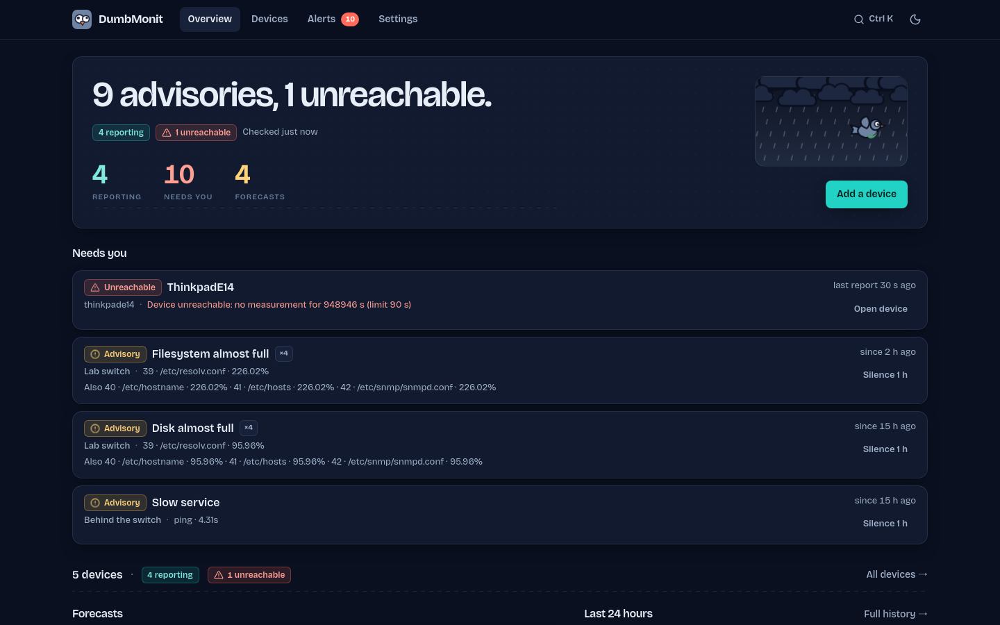
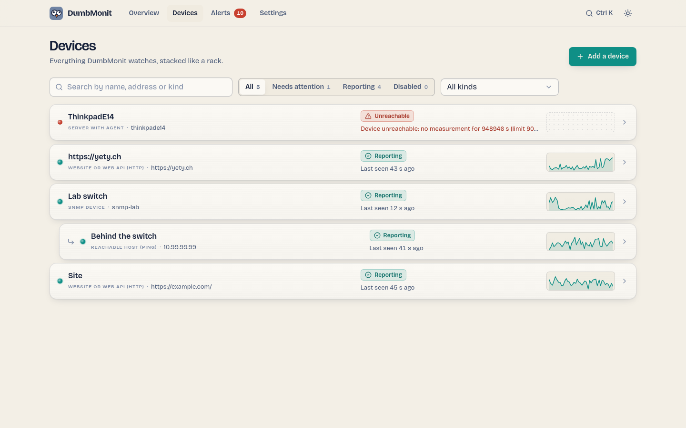
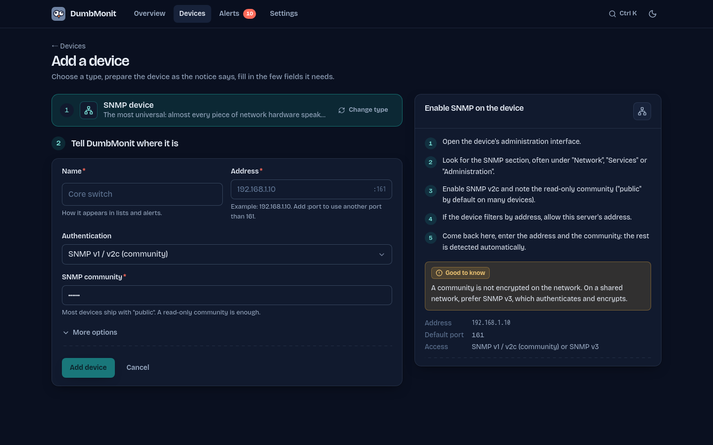
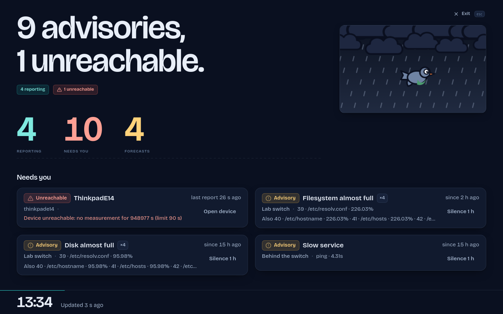

<div align="center">


# DumbMonit

**Dumb-simple monitoring for homelabs and small teams.**

Two containers, one IP address to type in, useful graphs and alerts in under a minute.<br>
The UI reads like a weather bulletin for your network. The mascot is a pigeon.

[](https://github.com/noekan/dumbmonit/actions/workflows/ci.yml)
[](https://dumbmonit.readthedocs.io/en/latest/)
[](LICENSE)
[](#quick-start)



</div>

## Why

**The one-second answer.** The home screen states "Clear skies." or "1 unreachable,
4 building up." before anything else. You open it once a day, or from a
notification, and know whether everything is fine before you have finished
sitting down. Drilling down is a click away; it is never required.

**One way to add anything.** A switch, a Proxmox cluster, a NAS, a Windows box, a
website: pick a type from the list, a notice on the right explains what to
prepare on the device, and the form only shows the fields that matter for that
type. SNMP profiles are detected from the device's `sysObjectID`; defaults do the
rest.

**Quiet by default.** Useful rules are active right after install, and the tool
works hard to send fewer, better alerts: a switch going down produces one
notification instead of thirty, maintenance windows are a first-class object, and
anomaly detection learns your network's rhythm before it says anything.

DumbMonit is for people who watch ten machines and three switches and do not
want to operate Zabbix or Checkmk, nor assemble Prometheus + Grafana +
Alertmanager + exporters. It is 100 % open source under the Apache 2.0 license,
dependencies included (CI fails on a non-OSI dependency): no feature is held
back for a paid edition.

## Features

**Sources**

- **SNMP v1 / v2c / v3** — switches, routers, NAS, UPS, printers. Five profiles
  ship with the product (IF-MIB, HOST-RESOURCES-MIB, UPS-MIB, PRINTER-MIB, system)
  and are applied automatically from the device's `sysObjectID`.
- **Proxmox VE** — nodes, VMs and containers, storage, cluster quorum, and the age
  of the last successful backup per machine (the backup that has not run for
  weeks, discovered before restore day).
- **Proxmox Backup Server** — datastore usage and fill-up forecast, deduplication
  factor, per-machine snapshot age and verification result, failed tasks (backup,
  verify, GC, sync), age of the last garbage collection.
- **Synology DSM** — volumes, disks and SMART health, temperature, load and
  services, through the NAS web API.
- **Linux and Windows agent** — CPU, memory, disks, network, services and uptime
  for machines that do not speak SNMP. One-line install, binaries served by the
  server (Linux x86_64 / aarch64, Windows x86_64).
- **Service monitors**, Uptime Kuma style — HTTP(S) (status code, keyword, JSON
  path, certificate), TCP port, DNS resolution, ping and TLS certificate expiry,
  each with its history bar, response time and availability percentage.
- **Network discovery** — sweep a CIDR and add everything that answers in one go.

**Alerting**

- Default rules: device unreachable, CPU saturated, disk almost full, disk full
  soon (extrapolation), UPS on battery, battery low, backup too old, service
  down / flapping / slow, certificate expiring soon or expired.
- **Dependency suppression** — declare a device as the parent of others; when the
  parent goes down, its descendants' alerts are suppressed instead of sent.
- **Grouping by host**, deduplication, periodic reminders and escalation.
- **Maintenance windows**, one-off or weekly.
- **Seasonal baseline** — anomaly detection with no threshold to tune: 168 buckets
  (hour × day of week) learn the usual behaviour; silent for its first 14 days,
  showing only what it *would* have fired.
- **Forecasts** — predictive rules (linear extrapolation computed by
  VictoriaMetrics: disk full soon, datastore full soon) are listed as forecasts on
  the overview, apart from what is broken right now.
- **22 notification channels** — Discord, Slack, Microsoft Teams, Telegram,
  Matrix, Mattermost, Rocket.Chat, Google Chat, ntfy, Gotify, Pushover, Pushbullet,
  Bark, Signal, Twilio (SMS), PagerDuty, Opsgenie, Home Assistant, Zulip, Apprise,
  email (SMTP) and a custom webhook. Each has a "Test" button; setup notes live in
  [`docs/notifications.md`](docs/notifications.md) and in the UI at
  `/docs/notifications`.

**Interface**

- Light and dark themes, following the system by default.
- **Wall mode** (`/wall`) — the bulletin alone, full screen, for a room monitor.
- **⌘K / Ctrl K palette** — jump to any page, device or action.
- Every device is a 1U faceplate: LED, name, kind, address, last seen, sparkline;
  children stack under their parent and dim when it is unreachable.
- Mobile works for reading state, silencing an alert and scheduling maintenance.

## Quick start

```bash
git clone https://github.com/noekan/dumbmonit.git
cd dumbmonit
docker compose up -d
```

Then open http://localhost:8080. The first visit lands on `/setup`, where you
choose the instance password. Add a device with its IP address and SNMP
community: the collection profile is detected automatically.

- **Another port**: `EZYMONIT_PORT=8099 docker compose up -d` (8080 is busy on
  most homelab machines).
- **Build locally instead of pulling the image**: `docker compose up -d --build`
  (about 10 minutes cold; needs nothing but Docker).
- **Lost password**: `EZYMONIT_RESET_PASSWORD=1 docker compose up -d` clears the
  password and all sessions at startup; the UI asks for a new one at `/setup`.
  Then run `docker compose up -d` again without the variable.
- **ICMP ping monitors** need the `NET_RAW` capability: uncomment the `cap_add`
  block in `docker-compose.yml`.

### Installing the agent

Create a token in *Settings → Agents*; the UI shows the install command with the
token filled in:

```sh
curl -sSL http://server:8080/install.sh | sh -s -- --token=ezym_xxx --url=http://server:8080
```

The agent registers itself as a device. A PowerShell script is served at
`/install.ps1` for Windows.

## What it looks like

| | |
|:-:|:-:|
|  |  |
| Devices, stacked like a rack | Add a device: type, notice, relevant fields only |
|  |  |
| Alerts, grouped by host | Wall mode for a room monitor |

More screenshots, in both themes, in [`.github/assets/screenshots/`](.github/assets/screenshots/).

## What runs

| Container | Role | Footprint |
|---|---|---|
| `ezymonit` | Collection, API, alerting, web UI | ~20 MB image, ~40 MB RAM |
| `victoriametrics` | Time series storage | ~100 MB RAM |

Configuration and state live in an embedded SQLite database: there is no third
database container. The published image is `ghcr.io/noekan/dumbmonit`
(`latest` = last release, `edge` = last commit on `main`).

## Configuration

Everything goes through environment variables; none is required.

| Variable | Default | Role |
|---|---|---|
| `EZYMONIT_BIND` | `0.0.0.0:8080` | Listen address |
| `EZYMONIT_DATA_DIR` | `/data` | SQLite database and instance secret |
| `EZYMONIT_VM_URL` | `http://victoriametrics:8428` | VictoriaMetrics URL |
| `EZYMONIT_SECRET` | *(generated)* | Encrypts device credentials |
| `EZYMONIT_MAX_CONCURRENT_PROBES` | `64` | Concurrent probes |
| `EZYMONIT_PROBE_TIMEOUT_SECS` | `10` | Maximum duration of one probe |
| `EZYMONIT_FLUSH_INTERVAL_SECS` | `5` | Write period towards VictoriaMetrics |
| `EZYMONIT_LOG` | `info` | Log filter (`tracing` syntax) |
| `EZYMONIT_AGENT_DIR` | `/agents` | Agent binaries served under `/download/…` |
| `EZYMONIT_RESET_PASSWORD` | *(empty)* | Set to `1` to clear the password and sessions at startup |

The `EZYMONIT_PORT` variable is read by `docker-compose.yml` only and sets the
host port (default `8080`).

### About the instance secret

SNMP communities, API tokens and passwords are encrypted with AES-256-GCM using a
key derived from the instance secret. On first start, DumbMonit generates this
secret in `/data/secret.key`.

**Back this file up together with the database.** Without it, device credentials
are unrecoverable. The server detects this at startup and refuses to continue
with an explicit message, rather than failing silently on every probe.

## Architecture

One Rust binary (which embeds the SvelteKit build) plus VictoriaMetrics for time
series and SQLite for configuration and state.

```
crates/proto     shared types: Sample, Target, Credential, trait Collector (+ ProbeError)
crates/server    the binary
  api/           axum routes; spa.rs serves the embedded web UI
  auth/          single instance password, HttpOnly session cookie, rate limit
  collectors/    snmp (profiles/*.yaml), proxmox, pbs, synology, agent, uptime
  scheduler.rs   runs every enabled target on its interval through the collector registry
  tsdb/          VictoriaMetrics writer (batched flush) + query proxy
  db/            SQLite + numbered migrations
  alerting/      rules, state machine, suppression by parent, silences, seasonal baseline
  notify/        22 notification channels, described to the UI by notify/catalog.rs
  crypto.rs      AES-256-GCM for credentials/tokens
crates/agent     Linux/Windows agent + install scripts
web/             SvelteKit (Svelte 5 runes, Tailwind 4, uPlot), static build embedded in the binary
profiles/        SNMP collection profiles, auto-applied by sysObjectID
```

Adding an integration means implementing the `Collector` trait
(`crates/proto/src/collector.rs`) and registering it: the scheduler and the API
know nothing about the concrete types. The UI is data-driven — the server
describes every device kind and every notification channel, so a new kind needs
no UI release.

## Documentation

The user guide lives at **[dumbmonit.readthedocs.io](https://dumbmonit.readthedocs.io)**:
installation, every source and notification channel, alerting, the agent, and
the HTTP API.

## Contributing

Bug reports, device profiles and new integrations are welcome. Read
[CONTRIBUTING.md](CONTRIBUTING.md) for the development setup (Docker only, no
Rust toolchain needed), the conventions, and how to add a collector or a
notification channel. Design rules for the UI are in [DESIGN.md](DESIGN.md) and
the product principles in [PRODUCT.md](PRODUCT.md).

Please report security issues privately: see [SECURITY.md](SECURITY.md).
This project follows the [Contributor Covenant](CODE_OF_CONDUCT.md).

## Status

Early, actively developed, and used daily on the author's own homelab. The HTTP
API is not frozen yet: expect changes between releases until 1.0. Crates,
environment variables and image names still say `ezymonit` (the former name);
they will keep working.

## License

Apache 2.0 — see [LICENSE](LICENSE).
