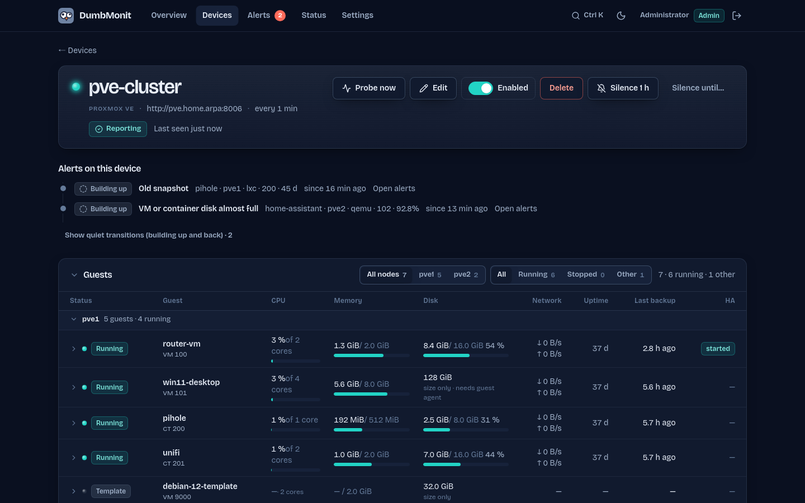

<div align="center">


# DumbMonit

**Dumb-simple monitoring for homelabs and small teams.**

One container, one IP address to type in, useful graphs and alerts in under a minute.<br>
The UI reads like a weather bulletin for your network. The mascot is a pigeon.

[](https://github.com/noekan/dumbmonit/actions/workflows/ci.yml)
[](https://dumbmonit.readthedocs.io/en/latest/)
[](LICENSE)
[](#quick-start)
[](#status)


</div>

> **Work in progress.** DumbMonit is under active development; the current
> build is an alpha for early testers (`ghcr.io/noekan/dumbmonit:latest`). It
> runs daily on the author's homelab, but expect rough edges and breaking
> changes. Feedback and bug reports are very welcome; see [Status](#status)
> for what is known to be missing.

## Why

**The one-second answer.** The home screen states "Clear skies." or "1 unreachable,
4 building up." before anything else. You open it once a day, or from a
notification, and know whether everything is fine before you have finished
sitting down. Drilling down is a click away; it is never required.

**One way to add anything.** A switch, a Proxmox cluster, a NAS, a Windows box, a
website: pick a type from the list, a notice on the right explains what to
prepare on the device, and the form only shows the fields that matter for that
type. SNMP profiles are detected from the device's `sysObjectID`; defaults do the
rest.

**Quiet by default.** Useful rules are active right after install, and the tool
works hard to send fewer, better alerts: a switch going down produces one
notification instead of thirty, maintenance windows are a first-class object, and
anomaly detection learns your network's rhythm before it says anything.

DumbMonit is for people who watch ten machines and three switches and do not
want to operate Zabbix or Checkmk, nor assemble Prometheus + Grafana +
Alertmanager + exporters. It is 100 % open source under the Apache 2.0 license,
dependencies included (CI fails on a non-OSI dependency): no feature is held
back for a paid edition.

## Features

**Sources**

- **SNMP v1 / v2c / v3** — switches, routers, NAS, UPS, printers. Five profiles
  ship with the product (IF-MIB, HOST-RESOURCES-MIB, UPS-MIB, PRINTER-MIB, system)
  and are applied automatically from the device's `sysObjectID`.
- **Proxmox VE** — nodes, VMs and containers, storage, cluster quorum, and the age
  of the last successful backup per machine (the backup that has not run for
  weeks, discovered before restore day).
- **Proxmox Backup Server** — datastore usage and fill-up forecast, deduplication
  factor, per-machine snapshot age and verification result, failed tasks (backup,
  verify, GC, sync), age of the last garbage collection.
- **Proxmox Datacenter Manager** — the console that federates several PVE clusters
  and backup servers: which instances it still reaches and why one dropped off,
  the whole estate in one page (guests running, nodes online, CPU, memory and
  storage totals), failed tasks across every site, and the console's own health.
- **Proxmox Mail Gateway** — the postfix queues and how long the oldest message
  has been stuck there, the mail counted and filtered today (spam, viruses,
  bounces, greylisting), quarantine sizes, and the age of the antivirus and
  antispam signature databases: the silent failure where the gateway keeps
  filtering with last week's rules. Counts only, never message content.
- **Synology DSM** — volumes, disks and SMART health, temperature, load and
  services, through the NAS web API; **Active Backup for Business** tasks, their
  last result and the age of the last success.
- **Linux and Windows agent** — CPU, memory, disks, network, services and uptime
  for machines that do not speak SNMP. One-line install, binaries served by the
  server (Linux x86_64 / aarch64, Windows x86_64).
- **Docker, through the agent** — container state, health, restarts, image age
  and available updates; opt-in per container: restart when down, update
  automatically (pull, recreate, health check, rollback) inside a maintenance
  window, prune the old image. **Plakar** backups: age and result of the last
  snapshot per kloset.
- **Service monitors**, Uptime Kuma style — HTTP(S) (status code, keyword, JSON
  path, certificate), TCP port, DNS resolution, ping and TLS certificate expiry,
  each with its history bar, response time and availability percentage.
- **Heartbeats** (dead man's switch) — a cron job, backup script or Home
  Assistant automation calls a secret URL each time it runs; if it stops
  calling, you are told. Uptime Kuma push-compatible (`?status=down&msg=`).
- **Network discovery** — sweep a CIDR and add everything that answers in one go.

**Alerting**

- Default rules: device unreachable, CPU saturated, disk almost full, disk full
  soon (extrapolation), UPS on battery, battery low, backup too old, service
  down / flapping / slow, certificate expiring soon or expired.
- **Dependency suppression** — declare a device as the parent of others; when the
  parent goes down, its descendants' alerts are suppressed instead of sent.
- **Grouping by host**, deduplication, periodic reminders and escalation.
- **Acknowledge an alert** — "I know, stop reminding me": reminders go quiet
  for four hours by default (up to thirty days) with an optional note, while the
  condition keeps being tracked. Resolution is still announced, and clears the
  acknowledgement, so the same alert notifies again if it comes back.
- **Maintenance windows**, one-off or weekly.
- **Notification policy** — hysteresis (trigger/clear thresholds), flap hold,
  per-channel cooldown, quiet hours, batching and an hourly cap, so a bad night
  does not turn into two hundred pushes.
- **Seasonal baseline** — anomaly detection with no threshold to tune: 168 buckets
  (hour × day of week) learn the usual behaviour; silent for its first 14 days,
  showing only what it *would* have fired.
- **Forecasts** — predictive rules (linear extrapolation computed by
  VictoriaMetrics: disk full soon, datastore full soon) are listed as forecasts on
  the overview, apart from what is broken right now.
- **22 notification channels** — Discord, Slack, Microsoft Teams, Telegram,
  Matrix, Mattermost, Rocket.Chat, Google Chat, ntfy, Gotify, Pushover, Pushbullet,
  Bark, Signal, Twilio (SMS), PagerDuty, Opsgenie, Home Assistant, Zulip, Apprise,
  email (SMTP) and a custom webhook. Each has a "Test" button; setup notes live in
  [the documentation](https://dumbmonit.readthedocs.io/en/latest/notifications/).

**Interface**

- Light and dark themes, following the system by default.
- **Wall mode** (`/wall`) — the bulletin alone, full screen, for a room monitor.
- **⌘K / Ctrl K palette** — jump to any page, device or action.
- Every device is a 1U faceplate: LED, name, kind, address, last seen, sparkline;
  children stack under their parent and dim when it is unreachable.
- Mobile works for reading state, silencing an alert and scheduling maintenance.
- **Public status pages** (`/s/<slug>`) — groups of monitors, incidents, RSS
  feed and a status badge, Uptime Kuma / Kener style.
- **Accounts** — admin and viewer roles, an optional **TOTP second factor**
  with recovery codes, an audit log of sign-ins and account changes, plus
  **OIDC / SSO** (Authentik, Authelia, Keycloak, Pocket ID…) with
  group-to-role mapping.
- **REST API with scoped tokens** — `read` or `write`, created in
  *Settings → API & assistants*; account and token management stays off limits
  to them. See [the API reference](https://dumbmonit.readthedocs.io/en/latest/reference/api/).
- **Install it on a phone** — a web manifest and home-screen icons; there is
  deliberately no offline mode, so the screen never shows yesterday's state.
- **Built-in MCP server** — connect Claude, ChatGPT or any MCP client with a
  scoped token and ask "is everything fine?" or "silence the NAS for an hour".
- **Readable by the Prometheus or Grafana you already run** — `GET /metrics`
  exposes the instance's own health, `GET /federate` the measurements by
  selector, and `/prometheus` answers as a Prometheus data source, all behind a
  read-only API token.
- **Backup and restore** — the whole configuration, credentials included, as
  one file encrypted with a passphrase you choose, which restores onto a fresh
  instance with a dry run first; plus a daily online copy of the database and
  of `secret.key` in `/data/backups/`, and a built-in rule when it stops
  happening.

## Quick start

```bash
mkdir dumbmonit && cd dumbmonit
curl -fsSLO https://raw.githubusercontent.com/noekan/dumbmonit/main/docker-compose.yml
docker compose up -d
```

That pulls `ghcr.io/noekan/dumbmonit:latest` (amd64 and arm64). To run from
source instead, clone the repository and use `docker compose up -d --build`
(about ten minutes; Docker is the only requirement).

Then open http://localhost:8080. The first visit lands on `/setup`, where you
create the first admin account. The overview then walks you through three
steps — add a device, connect a notification channel, check that a message
arrives — and each one is a single click. Add a device with its IP address and
SNMP community: the collection profile is detected automatically.

- **Another port**: `DUMBMONIT_PORT=8099 docker compose up -d` (8080 is busy on
  most homelab machines).
- **Update**: `docker compose pull && docker compose up -d` (from source:
  `git pull && docker compose up -d --build`).
- **Lost password**: another admin can set a new one in *Settings → Users*. If
  no admin can sign in, `DUMBMONIT_RESET_PASSWORD=1 docker compose up -d`
  removes every account and session at startup — devices, rules and channels are
  untouched — and the UI asks you to create the first admin again at `/setup`.
  Then run `docker compose up -d` again without the variable.
- **ICMP ping monitors** work without any capability: the container runs as a
  non-root user and `docker-compose.yml` sets the `net.ipv4.ping_group_range`
  sysctl that allows ICMP echo sockets. Keep those lines.
- **Backup**: *Settings → Backup* downloads the whole configuration as one
  encrypted file and restores it, and the server keeps a daily copy of its
  database in `/data/backups/`. `/data/secret.key` is what decrypts device
  credentials — a backup without it restores an instance that cannot talk to
  anything. See [Backup and restore](https://dumbmonit.readthedocs.io/en/latest/install/backup/).

### Installing the agent

Create a token in *Settings → Agents*; the UI shows the install command with the
token filled in:

```sh
curl -sSL http://server:8080/install.sh | sh -s -- --token=dmon_xxx --url=http://server:8080
```

The agent registers itself as a device. A PowerShell script is served at
`/install.ps1` for Windows.

The agent is also published as an image, `ghcr.io/noekan/dumbmonit-agent`
(same tags as the server), for Docker hosts and **remote sites**: with
`DUMBMONIT_AGENT_RELAY=true` the agent runs, on the server's behalf, the
probes of the devices you assign to it (SNMP, Proxmox, HTTP…) from its own
network, so several sites show up in one DumbMonit — outbound only, no VPN.
See `docker-compose.agent.yml` and [Monitor a remote site](docs/install/remote-site.md).

## What it looks like

| | |
|:-:|:-:|
|  |  |
| Devices, stacked like a rack | Add a device: type, notice, relevant fields only |
|  |  |
| Alerts, grouped by host | Wall mode for a room monitor |
|  |  |
| Proxmox VE: every guest at a glance | The same page, dark theme |

More screenshots, in both themes, in [`.github/assets/screenshots/`](.github/assets/screenshots/).

## What runs

| Container | Role | Footprint |
|---|---|---|
| `dumbmonit` | Collection, API, alerting, web UI, and the embedded VictoriaMetrics for time series | ~40 MB RAM + the VictoriaMetrics budget (256 MB by default) |

One container, one volume. The image ships the VictoriaMetrics binary and the
server runs it as a child process; set `DUMBMONIT_VM_URL` to use an instance
you already have instead. Configuration and state live in an embedded SQLite
database: there is no database container. The published image is
`ghcr.io/noekan/dumbmonit` (`latest` = last tagged build, `edge` = last
commit on `main`, or a version such as `0.1.0-alpha.1`).

## Configuration

Everything goes through environment variables; none is required.

| Variable | Default | Role |
|---|---|---|
| `DUMBMONIT_BIND` | `0.0.0.0:8080` | Listen address |
| `DUMBMONIT_DATA_DIR` | `/data` | SQLite database, instance secret, time series |
| `DUMBMONIT_VM_URL` | *(unset)* | External VictoriaMetrics; unset, the embedded one is started |
| `DUMBMONIT_VM_RETENTION` | `12` | Retention of the embedded VictoriaMetrics (months, or `30d`, `2y`) |
| `DUMBMONIT_VM_MEMORY` | `256MB` | Memory budget of the embedded VictoriaMetrics |
| `DUMBMONIT_SECRET` | *(generated)* | Encrypts device credentials |
| `DUMBMONIT_MAX_CONCURRENT_PROBES` | `64` | Concurrent probes |
| `DUMBMONIT_PROBE_TIMEOUT_SECS` | `10` | Maximum duration of one probe |
| `DUMBMONIT_FLUSH_INTERVAL_SECS` | `5` | Write period towards VictoriaMetrics |
| `DUMBMONIT_LOG` | `info` | Log filter (`tracing` syntax) |
| `DUMBMONIT_AGENT_DIR` | `/agents` | Agent binaries served under `/download/…` |
| `DUMBMONIT_RESET_PASSWORD` | *(empty)* | Set to `1` to remove every account and session at startup |

The `DUMBMONIT_PORT` variable is read by `docker-compose.yml` only and sets the
host port (default `8080`). The former `EZYMONIT_*` names are still accepted,
with a deprecation warning; see [CHANGELOG.md](CHANGELOG.md) for what the
rename changes.

### About the instance secret

SNMP communities, API tokens and passwords are encrypted with AES-256-GCM using a
key derived from the instance secret. On first start, DumbMonit generates this
secret in `/data/secret.key`.

**Back this file up together with the database.** Without it, device credentials
are unrecoverable. The server detects this at startup and refuses to continue
with an explicit message, rather than failing silently on every probe.

## Architecture

One Rust binary (which embeds the SvelteKit build) plus VictoriaMetrics for time
series, started by the server from the same image, and SQLite for configuration
and state.

```
crates/proto     shared types: Sample, Target, Credential, trait Collector (+ ProbeError)
crates/collectors  snmp (profiles/*.yaml), proxmox, pbs, pdm, pmg, synology, uptime — shared by the server and the relay agent
crates/server    the binary
  api/           axum routes; spa.rs serves the embedded web UI
  auth/          accounts and roles, HttpOnly session cookie, TOTP, OIDC, API tokens, rate limit
  collectors/    the agent collector (pushed metrics, commands, tokens) and the relay hub; re-exports crates/collectors
  scheduler.rs   runs every enabled target on its interval through the collector registry, or delegates it to its relay agent
  tsdb/          VictoriaMetrics writer (batched flush) + query proxy
  db/            SQLite + numbered migrations
  alerting/      rules, state machine, suppression by parent, silences, seasonal baseline
  notify/        22 notification channels, described to the UI by notify/catalog.rs
  crypto.rs      AES-256-GCM for credentials/tokens
crates/agent     Linux/Windows agent + install scripts; relay mode runs the shared collectors remotely
web/             SvelteKit (Svelte 5 runes, Tailwind 4, uPlot), static build embedded in the binary
profiles/        SNMP collection profiles, auto-applied by sysObjectID
```

Adding an integration means implementing the `Collector` trait
(`crates/proto/src/collector.rs`) and registering it: the scheduler and the API
know nothing about the concrete types. The UI is data-driven — the server
describes every device kind and every notification channel, so a new kind needs
no UI release.

## Documentation

The user guide lives at **[dumbmonit.readthedocs.io](https://dumbmonit.readthedocs.io)**:
installation, every source and notification channel, alerting, the agent, and
the HTTP API.

## Contributing

Bug reports, device profiles and new integrations are welcome. Read
[CONTRIBUTING.md](CONTRIBUTING.md) for the development setup (Docker only, no
Rust toolchain needed), the conventions, and how to add a collector or a
notification channel. Design rules for the UI are in [DESIGN.md](DESIGN.md) and
the product principles in [PRODUCT.md](PRODUCT.md).

Please report security issues privately: see [SECURITY.md](SECURITY.md).
This project follows the [Contributor Covenant](CODE_OF_CONDUCT.md).

## Status

**Work in progress — alpha.** DumbMonit is developed in the open and
used daily on the author's own homelab, but it is not ready for anyone who needs
it to be boring: the HTTP API is not frozen, the database schema still moves,
and some integrations have only been exercised against simulated devices, not
the real hardware. Known gaps and open bugs are tracked in the
[issues](https://github.com/noekan/dumbmonit/issues). Heartbeat monitors,
scoped API tokens covering the whole REST API and the TOTP second factor have
since shipped, as has backup and restore; there is still no upgrade guarantee
across schema changes. The project was called
EzyMonit until September 2026: `EZYMONIT_*` variables and the old agent
installation are still accepted and migrated.

## License

Apache 2.0 — see [LICENSE](LICENSE).
