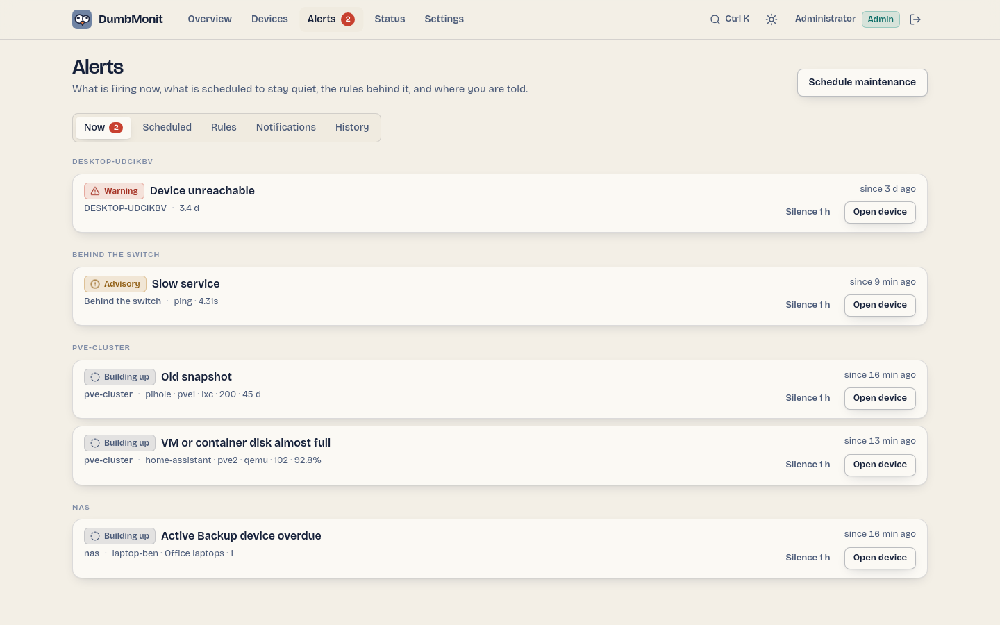

# How alerting works

Useful rules are active right after install; nothing needs tuning. What makes
the difference in daily use is what keeps the noise down: dependency
suppression, grouping by host, maintenance windows, and a baseline that learns
before it speaks.

{ loading=lazy }

## Severities

The interface speaks the weather bulletin's ladder. The API and the rule editor
store the same three levels under their engine names.

| In the UI | In the API (`severity`) | Meaning |
|---|---|---|
| Info | `info` | Worth knowing, no action expected. Used by the baseline rule. |
| Advisory | `warning` | Needs attention soon: CPU high, disk almost full, slow service. |
| Warning | `critical` | Needs you now: device unreachable, service down, backup verification failed, certificate expired. |

Escalation raises a rule's severity one rung after `escalate_after` if the
alert keeps firing (Info → Advisory → Warning; Warning stays).

## Phases

Every alert is a state machine, evaluated every 30 seconds
(`DUMBMONIT_ALERT_INTERVAL_SECS`).

| Phase | In the UI | Meaning |
|---|---|---|
| `ok` | — | The condition is false. |
| `pending` | Building up | The condition is true but the rule's hold (`for`) has not elapsed yet. Nothing is sent. |
| `firing` | Firing | The condition has held long enough. The first notification goes out, then reminders every `repeat_interval` (6 hours by default for most built-in rules), then an escalation if configured. |
| `resolved` | Resolved | Back to normal. A resolution notification is sent only if the firing had been announced. |
| `suppressed` | Suppressed by parent | The alert is firing, but a parent device is unreachable: see below. |

`phase` is the engine's state; `effective_phase` is what you read. An alert
whose `effective_phase` is `suppressed` keeps `phase = firing` underneath, so it
is not notified again when the parent recovers.

An alert can also be **acknowledged** (`acked`, with `acked_by`, `acked_until`
and `ack_note`): the phase does not move, reminders and escalations pause until
`acked_until`, the resolution is still notified and clears the acknowledgement.
See [Acknowledge vs silence](../using/alerts.md#acknowledge-vs-silence).

## Dependency suppression

Any device can declare a **parent device**. When a device is unreachable
(the "Device unreachable" rule fires on it), every alert on its descendants is
marked *Suppressed by parent* instead of being sent: a switch going down
produces one notification, not thirty. The nearest unreachable ancestor is
named as the cause (`suppressed_by`), and the chain is followed up to 64
levels.

Set the parent on the device form. On the Devices page, children stack under
their parent and dim when it is unreachable.

A [relay agent](../install/remote-site.md) counts as a parent of every device
it probes (*Reached through* on the device form), in addition to the parent
set explicitly: when the relay is unreachable, its devices are suppressed with
the relay named as the cause. At equal distance, the explicit parent wins.

A parent also counts as unreachable as soon as its own probe says so (the
*Timed out* / *Device unreachable* status on its page), without waiting for
its "Device unreachable" alert to fire: an agent that stops pushing takes
its devices with it a minute or two before its own alert, and they would
otherwise each notify first.

## Grouping, deduplication, reminders

Without grouping, a NAS whose RAID degrades would send one message per disk,
per cycle. DumbMonit sends at most one message per host and per cycle, even if
it contains five lines. Each alert is notified once when it starts firing
(`firing`), then only as a reminder (`reminder`, every `repeat_interval`), an
escalation (`escalation`) or a resolution (`resolved`). The alert history
records every transition with whether it was notified and, if not, why
(learning, suppressed, silenced, acknowledged).

## Maintenance windows

A silence stops notifications without stopping evaluation: at the end of a
window, an alert that is still active is notified once, rather than "born"
after two hours of existence. Windows are one-off or weekly, per device or for
the whole instance. See [Maintenance windows](maintenance.md).

## Baseline learning

The "Unusual CPU" rule needs no threshold. For every series it keeps 168
buckets, one per (day of week, hour), and compares each point to what is
usually observed *at that moment*. The score is robust (median and MAD, an
EWMA per bucket with `alpha = 0.05`), so a single incident does not rewrite the
baseline, and seasonal drifts are followed.

The rule stays **silent for its first fourteen days** of learning: each bucket
must have been seen at least twice to tell "unusual" from "never observed". In
the meantime it is shown with a *learning* flag and only tells you what it
would have fired. Baselines of series that disappeared are forgotten after 60
days.

## Forecasts

Two kinds of alert predict rather than report, and the overview lists them
under *Forecasts*: the baseline anomaly, and the `predict` rules that
extrapolate a series with `predict_linear()` on the VictoriaMetrics side
("Filesystem almost full" within four days). The PBS datastore estimate is a
plain threshold on PBS's own forecast.

## Where notifications go

Built-in rules have no channel attached, which means **every enabled channel**.
A rule you edit can name specific channels. Channels are configured in
Alerts → Notifications; see [Notification channels](../notifications.md).

## Smart notifications

Everything above decides *whether* an alert may speak. A second stage, the
notification policy, decides *when* and *on which channel*, so that nobody
gets spammed. The full path of one alert, in order:

1. **Evaluate** — threshold, anomaly score or forecast, with the rule's
   hold (`for`) and, when set, its **clear threshold** (hysteresis: fire
   above 90 %, clear only under 85 %) and any **per-device override**.
2. **Deduplicate** — one fingerprint per (rule, series), keyed on the
   device id (`target`) rather than its name: renaming a device or editing
   its tags does not create a second alert, and a series that resolves to
   the same key twice yields one alert. Series of a device that was deleted
   or paused are dropped: their alerts clear at once, without any
   notification, and the history records `device removed or disabled`.
3. **Suppress by dependency** — descendants of an unreachable device stay
   quiet.
4. **Silence** — maintenance windows mute what they cover.
5. **Group by device** — one message per device per cycle, reminders and
   escalation folded in.
6. **Flap hold** — a fingerprint that fires and clears 4 times in 30 minutes
   sends a single "flapping" notice, then nothing for 30 minutes.
7. **Per-channel filters** — minimum severity, "tell me when it clears"
   on/off, and a minimum interval between two messages about the same alert.
8. **Quiet hours** (per channel) — only Warning-level alerts come through;
   the rest waits for a digest when quiet hours end (an alert that clears
   meanwhile is only mentioned as "resolved during quiet hours").
9. **Batching** — alerts within the batch window (60 s by default) leave as
   one message per channel: "3 alerts on 2 devices, 1 resolved".
10. **Hourly cap** — past `max_per_hour` messages on a channel, alerts wait
    and arrive as one digest ("…and 7 more alerts").
11. **Send** — with an "Open in DumbMonit" link per device when a public URL
    is known.

Steps 6 to 10 are configured in Alerts → Notifications → Notification policy (global) and
on each channel (Delivery options). See [Notification policy](notifications.md).
