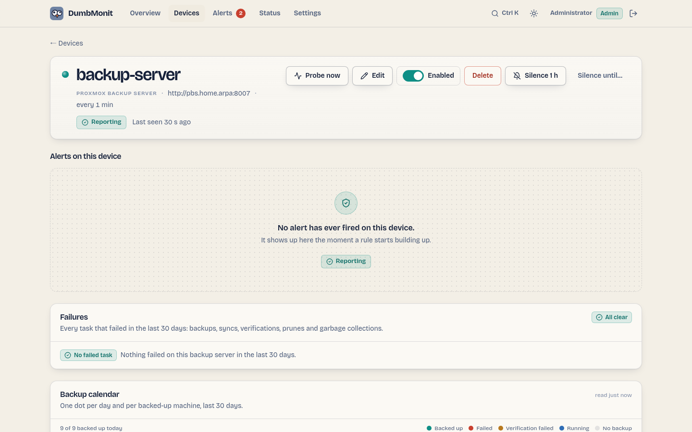

# Proxmox Backup Server

Backup server: a thirty-day backup calendar per machine, failed tasks with
their logs, scheduled jobs (sync, verify, prune, garbage collection),
datastores, disks and ZFS pools, pending updates, the services and package
versions of the server itself, and the tape tier when there is one.

## The device page

{ loading=lazy }

Beyond the generic charts, a PBS device shows six panels, read from what the
probe stored — opening the page never queries PBS itself:

* **Failures** — every task that failed in the last 30 days (backup, sync,
  verify, prune, GC), newest first, with its type, what it targeted, when it
  started and PBS's own error message. *Show log* fetches the last lines of
  the task log from PBS on demand (`/nodes/localhost/tasks/{upid}/log`).
* **Backup calendar** — one row per backed-up machine (datastore, namespace,
  `type/id`, and the guest name when PVE wrote it in the snapshot notes), one
  dot per day: teal when a backup succeeded that day (a task ended `OK`, or a
  snapshot exists — synced groups have no local task), red when a backup task
  failed and none succeeded, amber when the backup is there but its
  verification failed, blue while one is running, grey when nothing happened.
  Each dot's tooltip gives the time, size, duration and error excerpt; the row
  says when the last success and the last failure were, the snapshot count,
  the size of the latest snapshot and the retention of the prune job that
  applies. A machine whose backups all fail has no snapshot at all and still
  appears — from its tasks.
* **Jobs** — each sync, verify and prune job and the GC of each datastore,
  with schedule, last run, outcome, next run; a failed last run gets a red
  plate and the error text, failures sort first.
* **Tape** — only when the server has a tape tier. Tape backup jobs with their
  pool, drive, the label of the next tape expected, the last run and its
  error; media pools with their allocation and retention policies, how many
  tapes they hold, how many have expired and whether they are encrypted;
  drives and changers; and the tapes themselves with their status, media set,
  location and bytes written.
* **Datastores and disks** — usage bar, PBS's own fill-up forecast,
  deduplication factor, last GC; ZFS pools with their health; physical disks
  with the SMART verdict and SSD wear, and the full SMART table on demand
  (`/nodes/localhost/disks/smart`). Per datastore it also shows a maintenance
  or "Not mounted" plate, a "Busy: n writes, n reads" plate, the growth
  measured per day and over how many days of history, how many machines of
  each type it holds, how long the last GC took, and a warning line when that
  GC found unreadable chunks.
* **Server** — the systemd units, with the ones the server cannot do without
  called out; the Proxmox package versions (installed, available, running),
  with a "Restart pending" plate when the daemon is behind its package; the
  certificate and its expiry; and the traffic-control rules with their caps
  and what they are carrying.

The calendar splits days at the browser's local midnight. Its history comes
from the task list: the first probe after a start reads the last 30 days
(`/nodes/localhost/tasks?since=…&limit=5000`), later probes only the task
window, and the server keeps the union in SQLite (`pbs_task_history`, 35 days,
at most 10 000 tasks per device) so the calendar survives restarts.

## What it watches

All metrics are prefixed `dumbmonit_pbs_`.

| Family | Metrics | Labels |
|---|---|---|
| Node | `node_cpu_percent`, `node_cpu_count`, `node_iowait_percent` (CPU time waiting on I/O — on a backup server this is what says the disks are saturated), `node_load1/5/15`, `node_memory_used/total/free_bytes`, `node_memory_used_percent`, `node_swap_used/total_bytes`, `node_rootfs_used/total/avail_bytes`, `node_rootfs_percent`, `node_uptime_seconds`, `node_kernel_info`, `version_info` | |
| Datastores | `datastore_available`, `datastore_bytes_used/total/avail`, `datastore_used_percent`, `datastore_estimated_full_seconds` (PBS's own estimate; absent while it lacks data or usage is decreasing), `datastore_dedup_factor`, `datastore_removable_unmounted` (1 when a removable datastore is `notmounted` — not an error, it is simply not plugged in; label `mount_status`), `datastore_backend_info` (label `backend`, `filesystem` or `s3`), `datastore_maintenance` (1 when the datastore is held for maintenance; label `mode`, `offline`, `read-only`…), `datastore_groups` and `datastore_snapshots` (label `type`, `vm`/`ct`/`host`/`other`), `datastore_active_reads`, `datastore_active_writes` (what is holding the datastore right now — this is what explains a garbage collection that will not finish), `datastore_growth_percent_per_day`, `datastore_growth_bytes_per_day`, `datastore_history_days` | `datastore` |
| Garbage collection | `gc_last_removed_bytes`, `gc_last_pending_bytes`, `gc_last_run_ok` (PBS 3.3+), `gc_last_success_age_seconds`, `gc_last_duration_seconds`, `gc_disk_chunks`, `gc_last_pending_chunks`, `gc_last_removed_chunks`, `gc_bad_chunks` (chunks the GC found unreadable and left in place — corruption, not space to reclaim: a backup that references them can no longer be restored), `verify_last_success_age_seconds`, `sync_last_success_age_seconds` | `datastore` |
| Backup groups | `backup_count`, `backup_last_timestamp_seconds`, `backup_last_age_seconds`, `backup_last_size_bytes`, `backup_last_verified` (1 verified, 0 failed, absent if never verified) | `datastore`, `namespace`, `backup_type`, `group` |
| Namespaces | `namespace_groups`, `namespace_snapshots` (root namespace is `namespace=""`) | `datastore`, `namespace` |
| Tasks in the window | `tasks_running`, `tasks_ok`, `tasks_failed` | `worktype` (`backup`, `verificationjob`, `garbage_collection`, `prune`, `syncjob`…) |
| Jobs | `job_enabled`, `job_last_ok` (1 for `OK` or `WARNINGS: n`, 0 otherwise, absent if the job never ran), `job_never_run` (1 when a job is enabled, has a schedule and has never run — it has neither a failure nor a success, so it is invisible everywhere else), `job_last_run_age_seconds`, `job_next_run_seconds` (negative when overdue), `sync_jobs_total`, `verify_jobs_total`, `prune_jobs_total`; alias `sync_job_last_ok` for the rule | `job`, `datastore`, `kind` (`sync`, `verify`, `prune`); `remote` (`remote:remote-store`, or `local`) on sync jobs — the alias carries `job`, `datastore`, `remote` |
| Tape (option `tape`, off by default, five calls) | `tape_backup_job_last_ok`, `tape_backup_job_never_run`, `tape_backup_job_last_run_age_seconds`, `tape_backup_job_next_run_seconds`, `tape_backup_jobs_total`; `tape_drive_info` (presence series), `tape_drives_total`, `tape_changers_total`, `tape_media_pools_total`; `tape_media_total`, `tape_media_writable`, `tape_media_expired`, `tape_media_bytes_used` | `job`, `datastore`, `pool`, `drive` on the jobs; `drive`, `vendor`, `model`, `changer` on `tape_drive_info`; `pool` on the media counts |
| Disks (same names as Proxmox VE) | `node_disk_size_bytes`, `node_disk_smart_failed` (0 `passed`, 1 `failed`; absent when SMART gave no verdict), `node_disk_health_info` (presence series; labels `health`, `serial`, `used`), `node_disk_wearout_percent` (endurance used, SSD only, as PBS displays it: `100 − wearout`) | `disk` (`/dev/sda`), `model`, `type` |
| ZFS pools (same names as Proxmox VE) | `node_zfs_pool_degraded` (0 `ONLINE`, 1 otherwise), `node_zfs_pool_health_info` (label `health`), `node_zfs_pool_size_bytes`, `node_zfs_pool_alloc_bytes`, `node_zfs_pool_free_bytes`, `node_zfs_pool_used_percent`, `node_zfs_pool_fragmentation_percent` | `pool` |
| Updates | `node_updates_pending` (number of packages with an update available) | |
| Versions (option `updates`, from `/nodes/localhost/apt/versions`) | `node_package_upgradable` (1/0), `node_package_info` (presence series; labels `installed`, `available`, `running`), `node_running_version_stale` (1 when the installed `proxmox-backup-server` package is no longer the daemon that is running — the package was upgraded, the services were not restarted) | `package`, restricted to `proxmox-backup`, `proxmox-backup-server`, `proxmox-backup-client`, `proxmox-kernel-helper` |
| Services (option `services`, one call) | `node_service_active` (1 running, 0 not), `node_service_enabled` (absent for a `static` unit, which another unit pulls in and which is therefore neither enabled nor disabled), `node_services_total` | `service`, `expected` (`"1"` for `proxmox-backup`, `proxmox-backup-proxy` and `proxmox-backup-banner`, the units the server cannot do without; every other unit still gets its series, with `expected="0"`, and never raises an alert) |
| Certificate (option `certificates`, off by default) | `node_certificate_expires_seconds`, negative once expired | `certificate` (the file name), `issuer` |
| Traffic control (option `traffic_control`) | `traffic_rate_in_bytes`, `traffic_rate_out_bytes` (measured at the instant of the probe), `traffic_limit_in_bytes`, `traffic_limit_out_bytes` (the configured cap, parsed from PBS's decimal strings like `100 MB`; absent when that direction is uncapped, rather than a zero that would read as "everything is blocked"), `traffic_rules_total` | `rule` |
| Limits and collection | `backup_groups_total`, `backup_groups_dropped`, `up`, `scrape_errors`, `scrape_duration_seconds` | |

A task that ends in `WARNINGS: n` counts as successful. Calls per datastore are
limited to four in parallel: listing snapshots reads the datastore's indexes,
and a burst would slow down the backup in progress.

The job lists are not limited to the task window: a sync job that has been
failing for three weeks is still reported as failing. A job that never ran has
no `job_last_ok` series, but it does get `job_never_run`, and the "PBS job
never ran" rule fires on exactly that case.

Garbage collection is read with a single `/admin/gc` call covering every
datastore at once, where it took one `/admin/datastore/{store}/gc` per
datastore before; that per-datastore call remains as a fallback when
`/admin/gc` is unavailable — an older PBS, or a missing privilege — and is not
counted as an error. `/admin/gc` also carries the run duration and the chunk
counters the per-datastore call does not. `gc_last_run_ok` comes from
`last-run-state` on PBS 3.3 and later; on older versions it falls back to the
most recent garbage collection task of the window. The per-type counts come
from `/admin/datastore/{store}/status?verbose=1`: without `verbose`, PBS
returns only the sizes, which `/status/datastore-usage` already gave.
`/admin/datastore/{store}/namespace` returns the whole namespace tree, so
nothing is lost in sub-namespaces — `pve/site-a/rack1` is counted like the
root. Disks and pools come from `/nodes/localhost/disks/list` and
`/nodes/localhost/disks/zfs` (option `disks`; a 403 is tolerated, and so is
the 400 a server without ZFS answers: no pool series, no scrape error).

`datastore_growth_percent_per_day` is a least-squares fit over the usage
history PBS itself returns with `/status/datastore-usage`: a usage *fraction*
between 0 and 1, one point every thirty minutes over the last month, with
`null` holes that are skipped rather than filled — a server that was off did
not grow while it was off. These are the same numbers behind PBS's own "full
in N days" forecast. At least eight measured points are needed before anything
is published, and `datastore_history_days` says how much history the slope
covers. A negative value is not a fault: pruning is reclaiming more than the
backups add.

Nothing at all is published for tape when the server has no drive, no changer,
no pool and no tape job — an installation without tape must not grow a dozen
zero series that read like a tape tier in trouble. A tape that belongs to no
pool, blank media or media retired from a pool, is in no pool count.

Built-in rules that apply: Device unreachable, PBS datastore almost full, PBS
datastore filling up, PBS backup too old (per backup group: no new snapshot
for two days — edit the rule's threshold for a longer window), PBS backup
verification failed, PBS task failed, PBS garbage collection too old, PBS
garbage collection failed, PBS corrupt chunks found, PBS sync job failed, PBS
prune job failed, PBS verification job failed, PBS job never ran, PBS
datastore not mounted, PBS service down, PBS restart pending after upgrade,
PBS certificate expiring, PBS tape backup failed, PBS disk SMART failure, PBS
SSD worn out, PBS ZFS pool degraded, PBS updates pending. Notifications name
the job, datastore or backup group concerned.

## What to prepare in PBS

The steps below are the ones the notice next to the form shows. The principle:
a user reserved for monitoring, a token with a read-only role — never the
account you log in with.

1. Open a shell on the backup server (in the web UI: Administration → Shell;
   or SSH) and create a user reserved for monitoring. It needs no password:
   the token is what logs in.

    ```
    proxmox-backup-manager user create dumbmonit@pbs --comment "DumbMonit monitoring"
    ```

2. Create the user's API token. The command prints the token id and its
   secret: copy both now, PBS never shows the secret again.

    ```
    proxmox-backup-manager user generate-token dumbmonit@pbs monitor
    ```

3. Give the read-only minimum, per path — to the token and to the user
   that owns it. A token's effective privileges are the intersection of its
   own ACL and its user's: granted to the token alone, they amount to nothing
   at all, and PBS reports that nowhere. Every line is therefore written
   twice. `DatastoreAudit` on `/datastore` (`Datastore.Audit`) reads the
   datastores, snapshots, verify and prune jobs and GC; `Audit` on `/system`
   (`Sys.Audit`) reads the node status, the task list and task logs, the
   services, the traffic-control rules, the disks and ZFS pools.

    ```
    proxmox-backup-manager acl update /datastore DatastoreAudit --auth-id 'dumbmonit@pbs'
    proxmox-backup-manager acl update /datastore DatastoreAudit --auth-id 'dumbmonit@pbs!monitor'
    proxmox-backup-manager acl update /system Audit --auth-id 'dumbmonit@pbs'
    proxmox-backup-manager acl update /system Audit --auth-id 'dumbmonit@pbs!monitor'
    ```

    Optional, and twice as well. `RemoteAudit` on `/remote` (`Remote.Audit`)
    shows the sync jobs that pull from a remote: the built-in `Audit` role
    covers `Sys.Audit` and `Datastore.Audit` only, and without `Remote.Audit`
    such a job is not refused, it is simply absent from the job list.
    `TapeAudit` on `/tape` (`Tape.Audit`) reads the tape tier. `Audit` on `/`
    (`Sys.Audit` at the top level) lists pending package updates, and also
    covers `/datastore` and `/system` if you prefer fewer lines. Without them
    those items are silently skipped, nothing else changes. Nothing here can
    write: the collector only performs `GET`s.

    ```
    proxmox-backup-manager acl update /remote RemoteAudit --auth-id 'dumbmonit@pbs'
    proxmox-backup-manager acl update /remote RemoteAudit --auth-id 'dumbmonit@pbs!monitor'
    proxmox-backup-manager acl update /tape TapeAudit --auth-id 'dumbmonit@pbs'
    proxmox-backup-manager acl update /tape TapeAudit --auth-id 'dumbmonit@pbs!monitor'
    proxmox-backup-manager acl update / Audit --auth-id 'dumbmonit@pbs'
    proxmox-backup-manager acl update / Audit --auth-id 'dumbmonit@pbs!monitor'
    ```

4. Before leaving the shell, check what the token can actually read. The
   command prints its effective privileges, path by path; an empty result
   means the user is missing the ACL the token has — the case where the device
   looks perfectly alive and reports nothing.

    ```
    proxmox-backup-manager user permissions 'dumbmonit@pbs!monitor'
    ```

5. Copy the token id into DumbMonit's Token ID field and the secret into its
   Secret field.

    ```
    dumbmonit@pbs!monitor
    ```

6. Prefer the web UI? Configuration → Access Control: Users → Add, then API
   Tokens → Add, then Permissions → Add. Add each permission twice, once as
   User Permission for `dumbmonit@pbs` and once as API Token Permission
   for `dumbmonit@pbs!monitor`: with path `/datastore` and role
   `DatastoreAudit`, then again with path `/system` and role `Audit`. A token
   permission on its own grants nothing.
7. In DumbMonit, enter the server address, for example "pbs.lan" or
   "pbs.lan:8007".

!!! warning
    Do not reuse the account you log in with: a leaked token would then manage
    every backup. The Audit role can only read. PBS also uses a self-signed
    certificate by default: if the connection is refused for that reason, tick
    "Accept an unverifiable certificate" in the options.

Vendor documentation: [PBS API tokens](https://pbs.proxmox.com/docs/user-management.html#api-tokens).

## Credentials

| Credential | Fields |
|---|---|
| API token (recommended) | **Token ID**: user, realm and token name as PBS shows them, `dumbmonit@pbs!monitor`. **Secret**: the UUID shown once when the token was created. DumbMonit sends them as the `PBSAPIToken=user@pbs!name:secret` header PBS expects. |
| Username / password | `user@pbs` (or `@pam`) and the password. A ticket is obtained, cached and renewed ten minutes before its two-hour expiry. |

The API accepts the token in two pieces (`token_id` + `secret`) or, as older
versions did, as one string `token` = `user@pbs!name=secret`; both are stored
the same way. A whole token pasted into Token ID is split by the form.

Rights, read-only, and granted twice: a token's effective privileges are the
intersection of its own ACL and its user's, so each role below has to be given
to `dumbmonit@pbs` as well as to `dumbmonit@pbs!monitor`. Simplest: the
built-in `Audit` role on `/`, plus `RemoteAudit` on `/remote` for sync jobs
and `TapeAudit` on `/tape` for the tape tier — `Audit` covers `Sys.Audit` and
`Datastore.Audit` only, and those two roles exist precisely because it does
not. Per endpoint:

| Endpoint | Needs |
|---|---|
| `GET /version` | any authenticated user |
| `GET /nodes/localhost/status`, `GET /nodes/localhost/tasks`, `GET /nodes/localhost/tasks/{upid}/log` | `Sys.Audit` on `/system` (`Audit` on `/system`) |
| `GET /nodes/localhost/disks/list`, `…/disks/smart`, `…/disks/zfs` | `Sys.Audit` on `/system` (`Audit` on `/system`); a 403 is tolerated: no disk series, no scrape error. `…/disks/zfs` answers 400 on a server without ZFS, tolerated the same way |
| `GET /nodes/localhost/services`, `GET /admin/traffic-control` | `Sys.Audit` on `/system` (`Audit` on `/system`); a 403 is tolerated: no series, no scrape error |
| `GET /nodes/localhost/certificates/info` | `Sys.Modify` on `/system` — a **write** privilege, which is why the `certificates` option is off by default and why a monitoring token is not expected to have it |
| `GET /status/datastore-usage`, `GET /admin/gc`, `GET /config/datastore`, `GET /admin/datastore/{store}/gc`, `…/status`, `…/active-operations`, `…/namespace`, `…/snapshots` | `Datastore.Audit` on `/datastore/{store}` (`DatastoreAudit` on `/datastore`) |
| `GET /admin/verify`, `GET /admin/prune` | listed for the datastores where the token has `Datastore.Audit`; other jobs are silently omitted |
| `GET /admin/sync` | `Datastore.Audit` on the datastore **and** `Remote.Audit` on `/remote/{remote}` (`RemoteAudit` on `/remote`); other jobs are silently omitted |
| `GET /nodes/localhost/apt/update`, `…/apt/versions` | `Sys.Audit` on `/` (`Audit` on `/`); a 403 is tolerated: no update or version series, no scrape error |
| `GET /tape/backup`, `/tape/drive`, `/tape/changer`, `/config/media-pool`, `/tape/media/list` | `Tape.Audit` on `/tape` (`TapeAudit` on `/tape`); every failure is tolerated, a PBS without tape support included: no tape series, no scrape error |

Note that `Audit` on `/system` alone does not cover the update list, which PBS
checks at the root path. A 403 on the job lists or the update list is treated
as an optional privilege: nothing is produced and nothing is counted in
`scrape_errors`. And a role missing on the *user* is worse than a 403: the
call succeeds and returns an empty list, so nothing is produced and nothing
complains either.

Address: `10.0.0.20`, `pbs.lan`, `pbs.lan:8007`, `[fd00::2]` or a full URL.
The `https` scheme and port 8007 are added if missing.

## Options

| Key | Label | Default | Help |
|---|---|---|---|
| `port` | API port | `8007` | Used if the address does not give a port. |
| `insecure_tls` | Accept an unverifiable certificate | `false` | Proxmox Backup Server ships with a self-signed certificate by default: enable this if the connection is refused for that reason. |
| `request_timeout_seconds` | Timeout per request (seconds) | `15` | Time allowed for each API call, from 1 to 120. Listing the snapshots of a large datastore can take several seconds. |
| `task_lookback_hours` | Task window (hours) | `24` | Older tasks are not counted among the failures, from 1 to 8760. |
| `datastores` | Monitored datastores | *(empty)* | Names of the datastores to monitor, separated by commas. Empty: every datastore. |
| `max_groups` | Backup group limit | `500` | Maximum number of backed-up machines producing series; beyond it, the oldest are ignored. From 1 to 100000. |
| `jobs` | Watch scheduled jobs | `true` | Lists the sync, verify and prune jobs and their last run (`/admin/sync`, `/admin/verify`, `/admin/prune`). |
| `updates` | Watch pending updates | `true` | Counts the packages with an update available (`/nodes/localhost/apt/update`). |
| `disks` | Watch disks and ZFS pools | `true` | Reads the physical disks (SMART verdict, SSD wear) and the ZFS pools (`/nodes/localhost/disks`). |
| `services` | Watch the server's services | `true` | Reads the systemd units and reports whether the ones the server cannot do without are running. Needs `Sys.Audit` on `/system`; silently skipped otherwise. |
| `datastore_details` | Read datastore detail | `true` | Two more calls per datastore: how many machines and snapshots it holds, what is reading or writing it right now, and whether it is held for maintenance. |
| `traffic_control` | Watch traffic limits | `true` | Reads the rate limits and what they are carrying right now. Needs `Sys.Audit`; silently skipped otherwise. |
| `certificates` | Watch certificate expiry | `false` | Off by default: PBS guards this one call behind `Sys.Modify`, a write privilege a monitoring token should not be given. |
| `tape` | Watch tape backups | `false` | Reads the tape tier. Off by default, since most installations have no tape hardware. Needs `Tape.Audit` on `/tape`. |

## Common errors

| Symptom | Likely cause |
|---|---|
| Certificate error | Self-signed certificate: install a trusted one (ACME is built into PBS) or enable `insecure_tls`. |
| Authentication error | Secret pasted into Token ID (or the other way round), or the token has no `Audit` permission — most often because the role was granted to the token but not to the user that owns it, which does not fail: the calls succeed and return empty lists. Only `GET /version` failing condemns the whole probe; any other call failing is counted in `scrape_errors`. |
| Everything reads empty but the device is up | The user is missing the ACL the token has, and PBS intersects the two: `proxmox-backup-manager user permissions 'dumbmonit@pbs!monitor'` prints nothing. Grant every role to `dumbmonit@pbs` as well. |
| No `node_updates_pending` series | The token lacks `Sys.Audit` on `/`: give it the `Audit` role on `/`, or set `updates` to `false` to stop asking. |
| A sync job is missing | The token lacks `Remote.Audit` on the job's remote: add the `RemoteAudit` role on `/remote`. The job is not refused, it is simply absent from the list. |
| No certificate expiry | The `certificates` option is off, which is the default: PBS requires `Sys.Modify` for that call, a write privilege. |
| The Tape panel never appears | The `tape` option is off, which is the default, or the server has no drive, changer, pool or tape job. Nothing is published when there is nothing. |
| No growth figure on a datastore | PBS's usage history has fewer than eight measured points; it fills over the first days. |
| "PBS datastore filling up" never fires | `datastore_estimated_full_seconds` is computed by PBS from a month of measurements and is absent until then. |
| Missing groups | More than `max_groups` backed-up machines: `backup_groups_dropped` says how many were left out. |
| The calendar is empty or short | It fills from the task list at the first probe after a start (last 30 days); a PBS whose task archive was cleaned shows only what remains. A machine that was never backed up to this server and never had a task has no row. |
| A machine shows as `vm/104` without its name | PVE writes the guest name in the snapshot notes only with the default notes template (`{{guestname}}`); a custom template or an older PVE leaves the notes empty. |
| "Show log" fails | The token lacks `Sys.Audit` on `/system` for the task log, or PBS already rotated the log of an old task. |
