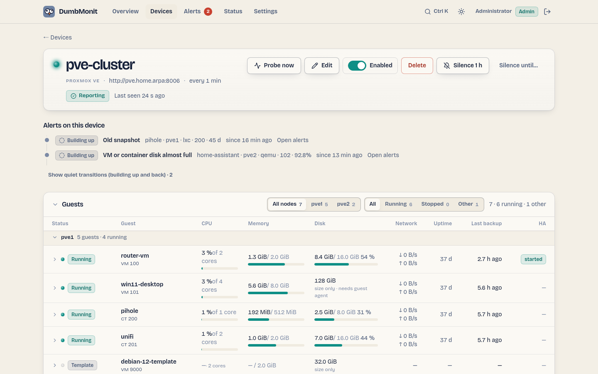

# Proxmox VE

Hypervisor: nodes, virtual machines, containers, storages, backups, high
availability, snapshots, replication, Ceph, physical disks and ZFS pools,
pending updates, package changes, subscription and certificates. One device
can cover a whole cluster.

## The guests panel

{ loading=lazy }

The device page opens with a **Guests** panel: one row per virtual machine and
container, grouped by node, that answers the questions an administrator asks
first — is it running, is it busy, is its disk full, when was it last backed
up. Each row shows:

| Column | Source | Notes |
|---|---|---|
| Status | word + plate: running, stopped, paused, suspended, template | A template is listed but never counts as "stopped". |
| Name, VMID, node | the inventory | |
| CPU | `guest_cpu_percent`, of the cores allocated to the guest | A bar plus the number of cores. |
| Memory | `guest_memory_used_bytes` / `guest_memory_total_bytes` | The balloon size when the VM has one. |
| Disk | `guest_disk_used_bytes` / `guest_disk_total_bytes` | Containers: real usage. VMs: size always; usage only when the QEMU guest agent answers (see below), otherwise "size only". |
| Network | `rate(guest_network_in/out_bytes)` over the last probes | |
| Uptime | `guest_uptime_seconds` | |
| Last backup | `backup_last_age_seconds` | Empty when no backup is known. |
| HA | `ha_resource_state_info` | Only for guests under high availability. |

The list sorts by any column, filters by node or status, and each node group
folds. Clicking a row opens its CPU and memory over the page's time range.
The data comes from `GET /api/targets/{id}/proxmox/guests`, which reads the
last probe from the metrics store — nothing is asked of the hypervisor.

### Disk usage inside a VM: the QEMU guest agent

Proxmox sees a VM's disk as an opaque volume: `disk` is always 0 for a VM,
only its size is known. To read the usage from inside, the collector asks the
QEMU guest agent (`agent/get-fsinfo`) for every running VM whose configuration
enables the agent (Options → QEMU Guest Agent). Two conditions:

* `qemu-guest-agent` installed and running inside the VM (Debian and Ubuntu:
  `apt install qemu-guest-agent`; Windows: the VirtIO drivers ISO);
* the token holds `VM.Monitor` on the VM (the `DumbMonit` role below grants
  it on `/`).

The root filesystem (`/`, or `C:\` on Windows; failing that, the largest one)
gives `guest_disk_used_bytes` and `guest_disk_used_percent`, the same series a
container has, so the "VM or container disk almost full" rule covers both.
Every real filesystem also gets `guest_fs_total/used_bytes` and
`guest_fs_used_percent` with a `mountpoint` label; pseudo filesystems (tmpfs,
squashfs, snap mounts) and media without capacity are skipped.
`guest_agent_enabled` says whether the VM's configuration enables the agent,
`guest_agent_running` whether it answered. Without the agent or the right, the
VM keeps its size and simply has no usage — never a misleading "0 %".

## What it watches

All metrics are prefixed `dumbmonit_proxmox_`.

| Family | Metrics | Labels |
|---|---|---|
| Cluster | `cluster_quorate`, `cluster_nodes`, `cluster_nodes_online`, `cluster_member_online`; `version_info` (+ `version`, `release`, `repoid`) | `cluster`, `node` |
| Nodes | `node_up`, `node_cpu_percent`, `node_cpu_count`, `node_load1/5/15`, `node_memory_used/total_bytes`, `node_memory_percent`, `node_swap_used/total_bytes`, `node_rootfs_used/total/avail_bytes`, `node_rootfs_percent`, `node_uptime_seconds`, `node_version_info` | `node` |
| Guests (VMs and containers) | `guest_status_info` (+ `status`: `running`, `stopped`, `paused`, `suspended`, `template`), `guest_running` (not for templates), `guest_cpu_percent` (of the allocated cores), `guest_cpu_count`, `guest_memory_used/total_bytes`, `guest_memory_percent`, `guest_disk_total_bytes`, `guest_disk_used_bytes` and `guest_disk_used_percent` (containers; VMs only through the guest agent), `guest_disk_read/write_bytes`, `guest_network_in/out_bytes` (counters), `guest_uptime_seconds` | `node`, `vmid`, `name`, `type` (`qemu` or `lxc`) |
| VM detail (running VMs) | `guest_agent_enabled`, `guest_agent_running`, `guest_balloon_bytes`, `guest_memory_guest_free_bytes` (free memory seen from inside, balloon driver); per filesystem `guest_fs_total_bytes`, `guest_fs_used_bytes`, `guest_fs_used_percent` | `node`, `vmid`, `name`, `type`; filesystems: + `mountpoint`, `fstype` |
| Storages | `storage_active`, `storage_enabled`, `storage_used/total/avail_bytes`, `storage_used_percent` | `node`, `storage`, `type` (`dir`, `lvmthin`, `zfspool`, `nfs`, `pbs`…), `shared` |
| Backups (per guest) | `backup_present`, `backup_last_timestamp_seconds`, `backup_last_age_seconds`, `backup_last_size_bytes`, `backup_count`; totals `backup_guests_total`, `backup_guests_without_backup` | `vmid`, `name`, `node`, `type` |
| Backups (vzdump runs, per node) | `backup_job_runs`, `backup_job_failures`, `backup_job_last_ok`, `backup_job_last_timestamp_seconds`, `backup_job_last_age_seconds`, `backup_job_last_duration_seconds` | `node` |
| Backup jobs (scheduled) | `backup_job_enabled`, `backup_job_next_run_seconds`, `backup_job_last_ok`, `backup_job_last_run_age_seconds` (the last two only when a `vzdump` task carries the job id, PVE 7.2+); totals `backup_jobs_total`, `backup_guests_not_covered`; `backup_covered` per guest (0 for a guest no job covers) | `job`, `storage`, `schedule`; `backup_covered`: `vmid`, `name`, `node`, `type` |
| HA | `ha_quorum_ok`, `ha_master_active`, `ha_lrm_active` (`node`), `ha_resources_total`; per resource `ha_resource_started`, `ha_resource_error` (1 in state `error`, `fence` or `recovery`), `ha_resource_state_info` (+ `state`) | `sid`, `node`, `vmid`, `type` |
| Snapshots | `guest_snapshot_count`, `guest_snapshot_oldest_age_seconds`, `guest_snapshot_newest_age_seconds` (ages only when count > 0); `guest_snapshot_guests_skipped` when `max_snapshot_guests` is exceeded | `vmid`, `name`, `node`, `type` |
| Replication | `replication_job_enabled`, `replication_job_error` (error message or `fail_count` > 0), `replication_job_fail_count`, `replication_job_last_sync_age_seconds`, `replication_job_next_sync_seconds`, `replication_job_duration_seconds`; `replication_jobs_total` | `job`, `vmid`, `node` (source), `to_node` |
| Ceph | `ceph_health` (0 OK, 1 WARN, 2 ERR, 3 unknown), `ceph_health_info` (+ `status`), `ceph_osds_total/up/in`, `ceph_bytes_total/used`, `ceph_used_percent`, `ceph_pgs_total`, `ceph_mons_total` | |
| Physical disks | `node_disk_size_bytes`, `node_disk_smart_failed` (1 when SMART health is `FAILED`; absent when the disk reports `UNKNOWN`), `node_disk_health_info` (+ `health`, `used`: `LVM`, `ZFS`, `partitions`…), `node_disk_wearout_percent` (SSD and NVMe: 0 new, 100 end of rated life), `node_disk_temperature_celsius` (from `disks/smart`: ATA attribute 194/190 or the NVMe report) | `node`, `disk` (`/dev/sda`, `/dev/nvme0n1`), `model`, `type` (`ssd`, `hdd`, `nvme`) |
| ZFS pools | `node_zfs_pool_degraded` (1 unless `ONLINE`), `node_zfs_pool_health_info` (+ `health`), `node_zfs_pool_size/alloc/free_bytes`, `node_zfs_pool_used_percent`, `node_zfs_pool_fragmentation_percent` | `node`, `pool` |
| Updates | `node_updates_pending`, `node_updates_security_pending` (packages whose origin, repository label, suite, section or changelog URL names a security archive, such as Debian's `bookworm-security`) | `node` |
| Package changes | `node_packages_changed`: 0 normally; for one hour after a probe sees the installed version of a Proxmox package change (`apt/versions`), the number of packages that changed, with a `changes` label such as `pve-manager 8.2.4→8.2.7, proxmox-kernel-6.8 6.8.8-2→6.8.12-2` | `node`, `changes` |
| Subscription and repositories | `node_subscription_active`, `node_subscription_info` (+ `status`: `active`, `notfound`, `expired`…, `level`, `next_due`); `node_repository_errors` (unreadable sources files), `node_repository_warnings` (Proxmox's own warnings: enterprise repository without subscription, test repository), `node_repository_enabled` (+ `repo`: `enterprise`, `no-subscription`, `test`, `ceph-*`) | `node` |
| Certificates | `node_certificate_expiry_days` (negative once expired) | `node`, `filename`, `subject` |
| Collection | `up`, `scrape_errors`, `scrape_duration_seconds` | |

The backup age per machine answers the most expensive failure of a homelab: the
backup that has not run for weeks, discovered on restore day. It is computed
from the `vzdump` task log (over `backup_lookback_days`) and, if
`scan_backup_storage` is on, from the archives found on the backup storages.

Scheduled jobs come from Datacenter → Backup: `backup_covered` is 0 for every
guest Proxmox itself lists as not covered by any job, so a machine created
yesterday shows up before its first missed backup rather than after.

Package changes are detected by the collector itself: it remembers the
installed versions from the previous probe (per device and node, in memory —
a server restart learns again without reporting). Only a package present in
both probes with a different version counts; a newly installed or removed
package does not.

A partial failure (one node down, one storage slow) is still a successful probe:
what could be read is written and the failure is counted in `scrape_errors`.
Features that are simply absent stay silent: no Ceph, no replication job, no
ZFS pool, no guest agent, or no right to list updates produce no series and no
error.

Board temperatures are not available: the Proxmox VE API does not expose
sensors, only the disks' own SMART temperature. Install the DumbMonit agent on
the node if you need more.

Built-in rules that apply: Device unreachable, High CPU, Disk almost full,
Filesystem almost full (forecast), Backup too old, Unusual CPU, VM or
container stopped, VM or container CPU high, VM or container memory high, VM
or container disk almost full, HA resource in error, Cluster lost quorum, Node
offline, Storage almost full, Backup job failed, Old snapshot, Replication
failed, Ceph health error, Ceph health warning, Updates pending, Security
updates pending, Proxmox packages changed, Proxmox disk wearing out, Proxmox
disk SMART failure, Proxmox ZFS pool degraded, Node certificate expiring.

## What to prepare in Proxmox

The steps below are the ones the notice next to the form shows. The principle:
a user reserved for monitoring, a role that can only read, a token — never the
account you log in with.

1. Open a shell on any node (in the web UI: select the node, then Shell; or
   SSH) and create a user reserved for monitoring. It needs no password: the
   token is what logs in.

    ```
    pveum user add dumbmonit@pve --comment "DumbMonit monitoring"
    ```

2. Create a role with only the privileges the collector uses: Sys.Audit
   (nodes, cluster, HA, disks and SMART, ZFS, certificates, package versions,
   subscription), Datastore.Audit (storages and backup archives), VM.Audit
   (VMs, containers, snapshots) and VM.Monitor (disk usage inside VMs, through
   the QEMU guest agent). None of them can change anything.

    ```
    pveum role add DumbMonit --privs "Datastore.Audit Sys.Audit VM.Audit VM.Monitor"
    ```

3. Give the user that role on the whole cluster.

    ```
    pveum aclmod / -user dumbmonit@pve -role DumbMonit
    ```

4. Create the user's API token. Privilege separation is off, so the token
   simply inherits the user's rights.

    ```
    pveum user token add dumbmonit@pve monitor --privsep 0
    ```

5. The command prints a table with full-tokenid and value. Copy full-tokenid
   into DumbMonit's Token ID field and value (the UUID) into its Secret field.
   The secret is shown once: if it is lost, remove the token and create a new
   one.

    ```
    dumbmonit@pve!monitor
    ```

6. Optional, to count pending updates and pending security fixes: Proxmox
   guards that list with Sys.Modify. Grant it on /nodes only; without it the
   collector skips the list silently.

    ```
    pveum role add DumbMonitUpdates --privs Sys.Modify
    pveum aclmod /nodes -user dumbmonit@pve -role DumbMonitUpdates
    ```

7. Prefer the web UI? The same steps live under Datacenter → Permissions:
   Users, Roles, Add → User Permission, then API Tokens with "Privilege
   Separation" unticked.
8. In DumbMonit, enter the address of any node (port 8006 by default).

!!! warning
    Do not reuse the account you log in with: a leaked token would then
    control the whole cluster. The DumbMonit role above can only read. Proxmox
    also uses a self-signed certificate by default: if the connection is
    refused for that reason, tick "Accept an unverifiable certificate" in the
    options.

Vendor documentation: [Proxmox VE user management](https://pve.proxmox.com/wiki/User_Management).

## Credentials

| Credential | Fields |
|---|---|
| API token (recommended) | **Token ID**: user, realm and token name as Proxmox shows them, `dumbmonit@pve!monitor`. **Secret**: the UUID shown once when the token was created. No expiry, no session opened on the hypervisor. |
| Username / password | `user@realm` and the password. A ticket is obtained, cached and renewed ten minutes before its two-hour expiry. |

The API accepts the token in two pieces (`token_id` + `secret`) or, as older
versions did, as one string `token` = `user@realm!name=secret`; both are
stored the same way. A whole token pasted into Token ID is split by the form.

The `DumbMonit` role above carries what `PVEAuditor` grants for the paths the
collector reads, plus `VM.Monitor`: the collector only ever does `GET`. Per
endpoint: `Sys.Audit` for `/version`, `/cluster/*`, `/nodes/{node}/status`,
`tasks`, `replication`, `certificates/info`, `disks/list`, `disks/smart`,
`disks/zfs`, `apt/versions`, `apt/repositories` and `subscription`;
`Datastore.Audit` for `storage` and `storage/{id}/content`; `VM.Audit` for
`qemu`, `lxc`, `snapshot` and `status/current`; `VM.Monitor` for
`agent/get-fsinfo`. The only thing the role does not cover is the list of
pending updates (`apt/update`), which Proxmox guards with `Sys.Modify` on
`/nodes` — optional, as step 6 explains; without it the collector skips
`node_updates_pending` and `node_updates_security_pending` silently.

(Use `-token 'dumbmonit@pve!monitor'` instead of `-user` in the `aclmod`
commands for a token created with "Privilege Separation" ticked.)

Address: `10.0.0.10`, `pve.lan`, `pve.lan:8006`, `[fd00::1]` or a full URL
`https://pve.example.net`. The `https` scheme and port 8006 are added if
missing.

## Options

| Key | Label | Default | Help |
|---|---|---|---|
| `port` | API port | `8006` | Used if the address does not give a port. |
| `insecure_tls` | Accept an unverifiable certificate | `false` | Proxmox ships with a self-signed certificate by default: enable this if the connection is refused for that reason. |
| `request_timeout_seconds` | Timeout per request (seconds) | `10` | Time allowed for each API call, from 1 to 120. |
| `backup_lookback_days` | Backup lookback (days) | `31` | Older backup tasks are not examined, from 1 to 3650. |
| `scan_backup_storage` | Inventory backup archives | `true` | Scans the backup storages to date the last backup of each machine. Disable if the storage is slow to answer. |
| `nodes` | Monitored nodes | *(empty)* | Names of the nodes to monitor, separated by commas. Empty: every node in the cluster. |
| `ha` | High availability | `true` | Reads `/cluster/ha/status/current`: quorum, CRM master, LRM per node and every HA resource. |
| `backup_jobs` | Scheduled backup jobs | `true` | Reads the jobs from Datacenter → Backup and the guests no job covers. |
| `scan_snapshots` | Inventory snapshots | `true` | One call per guest (four in flight per node). Disable on very large clusters. |
| `max_snapshot_guests` | Snapshot inventory limit | `200` | Guests beyond this number are skipped each probe and counted in `guest_snapshot_guests_skipped`, from 1 to 10000. |
| `replication` | Replication jobs | `true` | Storage replication status per node. Silent when the node has no job. |
| `ceph` | Ceph health | `true` | Reads `/cluster/ceph/status`. Silent when Ceph is not installed. |
| `updates` | Pending updates | `true` | Counts the packages `apt/update` lists. Needs `Sys.Modify` on `/nodes` (see above); silent otherwise. |
| `certificates` | Certificate expiry | `true` | Days left on each node certificate (`pve-ssl.pem`, `pveproxy-ssl.pem`, `pve-root-ca.pem`). |
| `guest_agent` | Ask the QEMU guest agent | `true` | For each running VM: `status/current` (balloon, agent flag) and, when the agent is enabled, `agent/get-fsinfo` (needs `VM.Monitor`). Four calls in flight per node. Silent when the agent is absent. |
| `disks` | Watch physical disks | `true` | `disks/list` plus one `disks/smart` call per disk: health, wearout, temperature. |
| `zfs` | Watch ZFS pools | `true` | `disks/zfs`: health, capacity, fragmentation. Silent without ZFS. |
| `packages` | Detect package changes | `true` | `apt/versions` compared with the previous probe; a change is reported for one hour in `node_packages_changed`. |
| `subscription` | Watch subscription and repositories | `true` | `subscription` and `apt/repositories`: status, warnings, enabled standard repositories. |

## Common errors

| Symptom | Likely cause |
|---|---|
| Certificate error shown on the device | Self-signed certificate. Either install a trusted certificate (ACME is built into Proxmox) or enable `insecure_tls`. The option is never enabled implicitly. |
| Authentication error | Secret pasted into Token ID (or the other way round), "Privilege Separation" left ticked (the token then has no rights), or the `DumbMonit` role not applied on `/`. |
| Backup age missing for a guest | No `vzdump` task in the lookback window and no archive found on the storages; or `scan_backup_storage` disabled. |
| Slow probes | A backup storage that takes long to list, or many guests to inventory for snapshots. Disable `scan_backup_storage` or `scan_snapshots`, lower `max_snapshot_guests`, or raise `request_timeout_seconds`. |
| `node_updates_pending` missing | The user or token lacks `Sys.Modify` on `/nodes`. Grant the `DumbMonitUpdates` role of step 6, or ignore: it is optional. |
| Disk usage empty ("size only") for a VM | The VM has no QEMU guest agent (not enabled in its options, or `qemu-guest-agent` not installed inside), or the token lacks `VM.Monitor`. `guest_agent_enabled` and `guest_agent_running` tell which. Containers never need it. |
| No `node_disk_*` series | The token lacks `Sys.Audit` on `/` (the `DumbMonit` role grants it), or the node runs behind a RAID controller that hides SMART: `disks/list` then reports `UNKNOWN` and no `node_disk_smart_failed` is published. |
| `node_packages_changed` fires after a server restart | It does not: the first probe after a restart only learns the versions. A change is reported only between two consecutive probes of the same server process. |
| `backup_job_last_ok{job=…}` missing while `backup_job_last_ok{node=…}` exists | The vzdump tasks do not carry the job id (Proxmox VE older than 7.2, or jobs run by hand). The per-node run status is still there. |
| No Ceph or replication metrics | Nothing to report: Ceph is not installed, or no replication job is configured. Not an error. |
