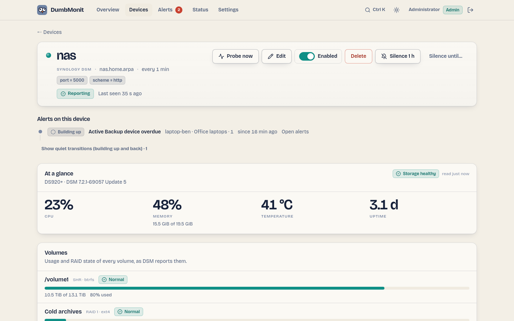

# Synology DSM

Synology NAS through the DSM web API: volumes, disk health, temperature, Hyper
Backup tasks and Active Backup for Business tasks. The first reason to monitor
a NAS is its disks: a disk that heats up or whose SMART status degrades
announces a failure long before a volume falls over.

## What it watches

All metrics are prefixed `dumbmonit_synology_`.

| Family | Metrics | Labels |
|---|---|---|
| System | `system_info` (model, DSM version, firmware…), `uptime_seconds`, `temperature_celsius`, `temperature_warning`, `system_crashed`, `system_need_repair`, `storage_health` | `model`, `dsm_version`, `firmware` |
| CPU and memory | `cpu_usage_percent`, `cpu_user/system/other_percent`, `cpu_cores`, `memory_total/used/available/installed_bytes`, `memory_usage_percent`, `swap_usage_percent` | |
| Network | `network_rx_bytes_per_second`, `network_tx_bytes_per_second` | `interface` |
| Volumes | `volume_status`, `volume_total/used/available_bytes`, `volume_used_percent`, `volume_used_warning_percent`, `volume_used_critical_percent`, `volume_full_warning`, `volume_full_critical` | `volume`, `fs_type`, `raid_type` |
| Disks | `disk_status`, `disk_smart_status`, `disk_temperature_celsius`, `disk_size_bytes`, `disk_bad_sector_exceeded`, `disk_life_below_threshold`, `disk_remaining_life_percent` (SSD only: the life the drive says it has left), `disk_unc_count` (DSM's unreadable-sector counter, the one it checks against its bad-sector threshold), `disk_info` | `disk`, `name`; on `disk_info`: `model`, `serial`, `vendor`, `firmware`, `type`, `ssd` |
| Hyper Backup | `backup_tasks`, `backup_running`, `backup_last_result`, `backup_last_run_age_seconds`, `backup_last_success_age_seconds`, `backup_next_run_in_seconds` | per task |
| Collection | `up`, `scrape_errors`, `scrape_duration_seconds` | |

Active Backup for Business metrics are the exception: they are prefixed
`dumbmonit_abb_` (see below).

`volume_status`, `disk_status` and `disk_smart_status` carry DSM's own word in
a label (`status`, `smart_status`) and a value on one scale: `0` normal, `1`
attention (a transient state such as `repairing` or `checking`, or a word DSM
introduced that DumbMonit does not know yet), `2` critical (`degrade`,
`crashed`, `failed`…). The unknown deliberately counts as `1`, never `0`.

A partial failure stays a successful probe: if the storage inventory fails, the
system state and utilisation are still published and the failure is counted in
`scrape_errors`. Only a failure on the API discovery call or on the connection
condemns the whole probe.

!!! note "What the disk rows cannot show"
    Reallocated-sector counts live in the per-disk SMART attribute table, which
    DSM only serves through an undocumented call whose shape DumbMonit has not
    been able to confirm. The rows therefore show what `load_info` gives:
    DSM's bad-sector verdict, its unreadable-sector counter (and its growth),
    and the SSD's remaining life.

## The device page

{ loading=lazy }

A Synology device gets its own panel above the charts:

* **At a glance** — CPU, memory (used of total), temperature and uptime, with
  DSM's own storage verdict as a plate (healthy, attention, crashed, repair
  needed);
* **Volumes** — one row per volume: usage bar, used of total, RAID type and
  file system, the volume's state in DSM's word (normal, degraded, crashed,
  repairing…);
* **Disks** — one row per bay: model, size, temperature, SMART verdict, DSM's
  bad-sector verdict, the unreadable-sector counter and, on an SSD, the life
  left as a small bar;
* **Active Backup for Business** — the tasks, then every backed-up device with
  its rhythm and a thirty-day strip (see below).

Everything comes from what the probe stored: opening the page never queries
the NAS.

### Built-in rules for the NAS

| Rule | Severity | Fires when |
|---|---|---|
| Synology disk SMART warning | advisory | DSM no longer reports the disk's SMART status as `normal`, for 15 minutes. |
| Synology disk failed | warning | DSM reports the disk as crashed or failed, for 5 minutes. |
| Synology disk bad sectors | warning | The bad-sector count exceeds the threshold set in DSM, for 15 minutes. |
| Synology disk bad sectors growing | advisory | New unreadable sectors appeared in the last 24 hours (`delta(…disk_unc_count[24h]) > 0`). |
| Synology SSD wearing out | advisory | An SSD has less than 10 % of its rated life left, for an hour. |
| Synology volume degraded | warning | A volume is degraded or crashed, for 5 minutes. |
| Synology volume almost full | advisory | A volume is 90 % full or more, for 15 minutes. |
| Synology temperature high | advisory | A disk is above 55 °C, or DSM raised its temperature warning, for 15 minutes. |
| Synology memory high | advisory | Memory usage above 95 % for 15 minutes. |

## Active Backup for Business

Active Backup for Business (ABB) backs up PCs, physical servers, virtual
machines and file servers to the NAS. If the package is installed, DumbMonit
reads its tasks on every probe; if it is not, the NAS simply does not
advertise the API and nothing is asked. The option `abb` turns the whole
family off.

| Metric | Value | Labels |
|---|---|---|
| `dumbmonit_abb_tasks` | Number of tasks. | |
| `dumbmonit_abb_task_last_status` | Last run: `1` success, `0` failed, `2` running, `-1` unknown (never run, cancelled, no backup). A *partial* success counts as failed: at least one device was not backed up. | `task`, `task_id`, `source_type`, `result` |
| `dumbmonit_abb_task_last_success_seconds` | Age of the last successful backup run, in seconds. Absent for a task that never succeeded. | `task`, `task_id`, `source_type` |
| `dumbmonit_abb_task_enabled` | `1` if the task has a schedule and is not paused, `0` if it only runs by hand. | `task`, `task_id`, `source_type` |
| `dumbmonit_abb_task_device_count` | Devices attached to the task. | `task`, `task_id`, `source_type` |

`task` is the task name as shown in ABB; `source_type` is `pc`, `vm`,
`physical_server`, `file_server` or `nas`; `result` is the raw result of the
last run (`success`, `partial_success`, `fail`, `cancel`, `no_backup`,
`running`, `none`).

The age is taken from the task history filtered on successful backup runs,
not from the task's "last result": after a nightly version purge, the last
result is the purge, not the backup. This costs one request per task, capped
at twenty tasks.

Built-in rules on tasks:

| Rule | Severity | Fires when |
|---|---|---|
| Active Backup task failed | warning | The last run failed, or was a partial success, for 10 minutes. The notification names the task. |
| Active Backup too old | advisory | No successful run for more than two days. |
| Active Backup task disabled | info | The task has no schedule, or its continuous backup is paused, for an hour. |

### Devices and their rhythm

A task-level rule is right for a server and wrong for a laptop: people do not
leave their laptops on, and "no backup for 24 hours" is Monday morning for
every office PC. DumbMonit therefore also watches ABB **device by device**,
against the device's own habits.

On every probe, the collector reads the per-device runs ABB keeps
(`SYNO.ActiveBackup.Overview` `list_device_transfer_size`, one call for all
devices, only what changed since the previous probe) and copies them into its
own database — bounded to ninety days per NAS — so that the model survives a
restart without re-reading a month of history. Then, for each device, it looks
at the last thirty days.

| Metric | Value | Labels |
|---|---|---|
| `dumbmonit_abb_device_state` | `0` ok, `1` idle, `2` learning, `3` running, `4` overdue, `5` failing, `6` never. | `device`, `device_id`, `task`, `task_id`, `state` |
| `dumbmonit_abb_device_overdue` | `1` while the device is overdue, `0` otherwise. | `device`, `device_id`, `task`, `task_id` |
| `dumbmonit_abb_device_consecutive_failures` | Failed attempts in a row since the last success (a cancelled run counts as neither). | same |
| `dumbmonit_abb_device_last_success_seconds` | Age of the last successful run of this device. Absent if it never succeeded. | same |
| `dumbmonit_abb_device_typical_interval_seconds` | Median gap between two successes, off-days excluded. Absent while learning. | same |

#### How "overdue" is judged

In plain words, for each device:

1. **Which days is it on?** A weekday on which the device attempted at least
   one backup in the last thirty days — successful or not; a failure proves
   the machine was on as much as a success — is an *active day*. Once there
   are at least two weeks of history, a weekday with no attempt at all is an
   *off-day*. A laptop used Monday to Friday gets Saturday and Sunday as
   off-days; a server has none.
2. **How often does it back up?** The gaps between consecutive successes are
   collected in *active time*: the full off-days a gap contains are not
   counted (Friday evening to Monday evening is one day of active time, not
   three). Their median is the device's *typical interval*; their 90th
   percentile is what "a slow week" looks like.
3. **How long is it allowed?** The allowance is
   `max(1.5 × p90 gap, 2 × typical interval, 36 h)`. A nightly desktop gets
   48 h; a machine backed up every three days gets about six; nobody gets less
   than a day and a half. While fewer than two usable gaps exist (a device
   added this week), the allowance is 72 h — enough to cross a weekend without
   a false alarm.
4. **How much active time has passed?** The time since the last success,
   minus the full off-days it contains. A laptop last backed up Friday at
   20:00 has, on Monday at 08:00, twelve hours of active time behind it, not
   sixty.
5. **The verdict**, in this order: *running* (a backup is in progress);
   *failing* (the last two or more attempts failed — a partial success is a
   failure, a cancelled run is neither); *never* (no success on record);
   *overdue* (active time exceeds the allowance); *idle* (today is one of its
   off-days: off, as usual); *learning* (rhythm not known yet); *ok*.

Only *overdue* raises `dumbmonit_abb_device_overdue`, and only *failing* feeds
the failure rule. An idle laptop on a Sunday raises nothing; the same laptop
still silent on Tuesday night does.

Days and hours are expressed in the server's local time (`TZ` of the
container), which is where the person reading the page lives. The device page
shows, per device: the state in a word, the last success and last result, the
rhythm in words ("weekdays, around 20:00", "every ~3 days, on Mon, Wed, Fri,
around 03:00", "still learning (2 runs in 30 days)") and a thirty-day strip —
teal for a day with a success, red for a failure, amber for a cancelled run,
grey for no run.

Built-in rules on devices:

| Rule | Severity | Fires when |
|---|---|---|
| Active Backup device overdue | advisory | `dumbmonit_abb_device_overdue > 0` for 30 minutes. |
| Active Backup device failing | warning | Two or more failed attempts in a row, for 10 minutes. |

!!! warning "Permissions"
    ABB only answers an account in the `administrators` group with the package
    allowed in its application permissions, or an account to which the package
    has been delegated (DSM 7: Active Backup for Business → Settings →
    Privileges). An account denied the application cannot read ABB tasks: the
    call is refused (code 105) and counted in `scrape_errors`. Either allow or
    delegate the package to the monitoring account, or untick "Watch Active
    Backup for Business" (`abb = false`) to stop asking.

!!! note "An undocumented API"
    Synology does not document the ABB web API. DumbMonit follows the shape
    recorded by community projects (`SYNO.ActiveBackup.Task` `list`,
    `SYNO.ActiveBackup.Log` `list_result` and `SYNO.ActiveBackup.Overview`
    `list_device_transfer_size`, all version 1) and discovers their path
    through `SYNO.API.Info`. A DSM whose answers differ produces missing
    metrics, never a failed probe; an ABB too old to offer the per-device
    overview keeps its task metrics and simply has no device rhythm.

## What to prepare on the NAS

The steps below are the ones the notice next to the form shows. The principle:
an account reserved for monitoring, stripped of everything DSM's API does not
need — never the account you log in with.

1. In DSM, open Control Panel → User & Group → User and click Create. Name the
   account as follows and give it a long password that is used nowhere else.

    ```
    dumbmonit
    ```

2. Join groups: tick administrators. DSM only answers the storage, volume and
   disk SMART calls to that group; without it the NAS shows as alive but says
   nothing about its disks. The next two steps take back everything else.
3. Assign shared folder permissions: No access on every shared folder. Assign
   application permissions: Deny everything except DSM, plus Active Backup for
   Business if you want its tasks read. Skip the quota and speed limit pages.
4. Two-step verification must stay off for this account: no automated monitor
   can type a one-time code. If Control Panel → Security → Account enforces
   it, restrict the rule to groups this user is not in, or exempt it.
5. Active Backup for Business, if installed: its tasks are read only by an
   account allowed to use the package (Active Backup for Business → Settings →
   Privileges). Otherwise untick DumbMonit's "Watch Active Backup for
   Business" option to stop asking.
6. In DumbMonit, enter the NAS address (HTTPS, port 5001 by default), then
   this account's user name and password.

!!! warning
    The administrators group is required by DSM's storage API, not by
    DumbMonit. That is why this account gets no shared folder, no application
    and a password used nowhere else: it can read the NAS, not touch your
    files.

!!! note "Which rights give which metrics"
    The DSM API does not need the same rights for every call. System status
    (model, version, temperature, uptime) answers to any account. CPU, memory,
    volumes and, above all, disk SMART status require the `administrators`
    group. On DSM 7, the "System monitoring" delegation (Control Panel → User &
    Group → Delegation) is enough for utilisation but not for the storage
    inventory. An account without particular rights therefore gives a NAS that
    is "alive", but nothing about its disks.

Vendor documentation: [Create a user in DSM](https://kb.synology.com/en-global/DSM/help/DSM/AdminCenter/file_user_create).

## Credentials

| Credential | Fields |
|---|---|
| DSM account | **User name**: the account created above. **Password**: its password. Two-step verification must be off for this account: no automated monitor can type a one-time code. |

Address: `192.168.1.30`, `nas.lan` or `nas.lan:5001`. Without a port, 5001 is
used over HTTPS and 5000 over HTTP.

## Options

| Key | Label | Default | Help |
|---|---|---|---|
| `scheme` | Protocol | `https` | HTTPS fits a NAS fresh out of the box. HTTP only if DSM listens in clear text only. Choices: `https`, `http`. |
| `port` | DSM port | *(empty)* | Used if the address does not give a port. Empty: 5001 over HTTPS, 5000 over HTTP. |
| `insecure_tls` | Accept an unverifiable certificate | `false` | A NAS ships with a self-signed certificate by default: enable this if the connection is refused for that reason. |
| `request_timeout_seconds` | Timeout per request (seconds) | `15` | Time allowed for each API call, from 1 to 120. The storage inventory can wake up sleeping disks. |
| `abb` | Watch Active Backup for Business | `true` | Reads the Active Backup for Business tasks. Needs the package installed and an account allowed to use it; a NAS without the package is simply skipped. |

## Common errors

| Symptom | Likely cause |
|---|---|
| Authentication error | Wrong password, or two-step verification required for this account. DSM answers HTTP 200 even on failure; the error code in the JSON body is what counts, and DumbMonit reads it. |
| Certificate error | Self-signed certificate: enable `insecure_tls`. This is a configuration error, never "unreachable": a NAS that answers is not shown as off. |
| No disk or volume metrics | The account is not in the `administrators` group (see the note above). |
| No `dumbmonit_abb_*` metrics, `scrape_errors` at 1 | The account cannot use Active Backup for Business: delegate the package to it, or disable the `abb` option. Without the package installed there is no error and no metric. |
| Task metrics but no device rows on the page | The NAS does not advertise `SYNO.ActiveBackup.Overview` (older ABB), or the device is probed through a relay agent, which keeps the history in memory on its side: the metrics exist, the calendar does not. |
| A laptop shows "Overdue" the day after it was added | Fewer than three successes: the model is still learning and allows 72 hours between backups; it settles once two weeks of habits are known. |
| Disks spin up on every probe | The storage inventory wakes sleeping disks. Lengthen the check interval. |
