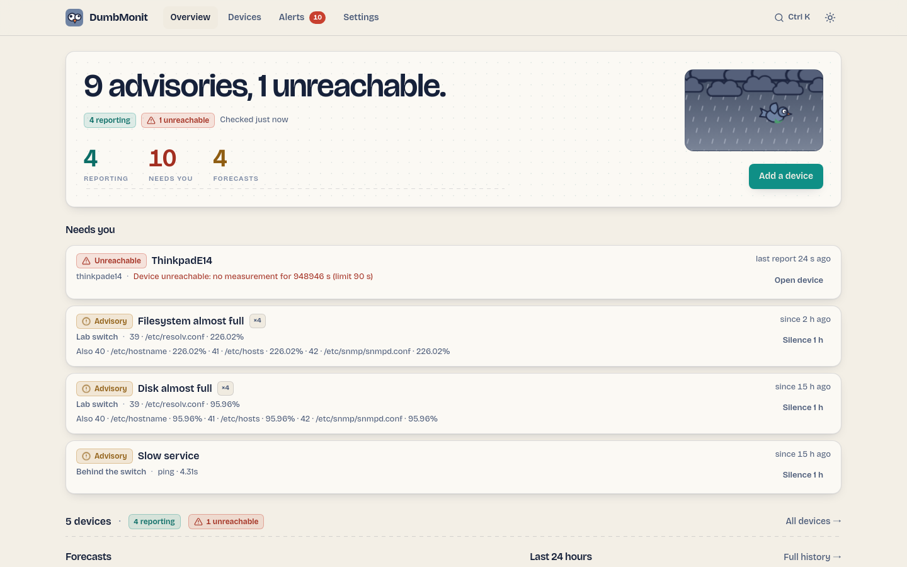

# Install with Docker

DumbMonit runs as two containers: the `ezymonit` server (collection, API,
alerting, web UI) and VictoriaMetrics (time series storage). Everything else,
including configuration and state, lives in an embedded SQLite database inside
the server's data volume.

## Prerequisites

- Docker Engine with the Compose plugin (`docker compose version` works).
- A machine that can reach the devices you want to monitor. It does not need to
  be reachable from them, except for [agents](../devices/agent.md), which push
  their measurements to the server over HTTP.
- Port `8080` free on the host, or another port of your choice (see below).

## The Compose file

Create a directory, then save this as `docker-compose.yml`:

```yaml
services:
  ezymonit:
    image: ghcr.io/noekan/dumbmonit:latest
    ports:
      # The host port is configurable: 8080 is a busy port on a homelab machine.
      # `EZYMONIT_PORT=8099 docker compose up -d` moves it.
      - "${EZYMONIT_PORT:-8080}:8080"
    volumes:
      - ezymonit-data:/data
    environment:
      EZYMONIT_VM_URL: http://victoriametrics:8428
      # Uncomment to set the secret yourself instead of letting DumbMonit
      # generate it in /data/secret.key. It encrypts device credentials:
      # losing it means re-entering all of them.
      # EZYMONIT_SECRET: replace-me-with-32-random-characters
      # Forgotten password: `EZYMONIT_RESET_PASSWORD=1 docker compose up -d`
      # clears the password at startup, the UI asks for a new one; then
      # start again without the variable.
      EZYMONIT_RESET_PASSWORD: ${EZYMONIT_RESET_PASSWORD:-}
    depends_on:
      - victoriametrics
    # Needed only for "ping" (ICMP) monitors:
    # cap_add:
    #   - NET_RAW
    restart: unless-stopped

  victoriametrics:
    image: victoriametrics/victoria-metrics:latest
    command:
      - "-retentionPeriod=12"        # 12 months
      - "-storageDataPath=/vmdata"
      - "-httpListenAddr=:8428"
    volumes:
      - vm-data:/vmdata
    restart: unless-stopped

volumes:
  ezymonit-data:
  vm-data:
```

Then start it:

```bash
docker compose up -d
```

!!! tip "Building the image yourself"
    The file in the repository uses `build: .` instead of `image:`. Cloning the
    repository and running `docker compose up -d --build` builds the same image
    locally (about ten minutes cold; no Rust or Node toolchain is needed on the
    host). Use that if you want to run from source or from a branch.

## First start

Open `http://<your-host>:8080`. A fresh instance shows the `/setup` screen and
asks you to choose a password (at least 12 characters). That single password
protects the whole instance; there are no user accounts. Once it is set, you are
sent to `/login`.

{ loading=lazy }

Then add your first device: see [Add your first device](first-device.md).

## Environment variables

Everything goes through environment variables; none is required.

| Variable | Default | Role |
|---|---|---|
| `EZYMONIT_BIND` | `0.0.0.0:8080` | Listen address inside the container. |
| `EZYMONIT_DATA_DIR` | `/data` | SQLite database (`ezymonit.db`) and instance secret (`secret.key`). |
| `EZYMONIT_VM_URL` | `http://victoriametrics:8428` | VictoriaMetrics URL. |
| `EZYMONIT_SECRET` | *(generated)* | Instance secret that encrypts device credentials and tokens. |
| `EZYMONIT_MAX_CONCURRENT_PROBES` | `64` | Concurrent probes, all collectors combined. |
| `EZYMONIT_PROBE_TIMEOUT_SECS` | `10` | Maximum duration of one probe. |
| `EZYMONIT_FLUSH_INTERVAL_SECS` | `5` | Write period towards VictoriaMetrics. |
| `EZYMONIT_LOG` | `info` | Log filter (`tracing` syntax, e.g. `debug`, `ezymonit=trace`). |
| `EZYMONIT_AGENT_DIR` | `/agents` | Agent binaries served under `/download/…`. |
| `EZYMONIT_RESET_PASSWORD` | *(empty)* | Set to `1` to clear the password and every session at startup. |
| `EZYMONIT_COOKIE_SECURE` | *(off)* | Set to `1` behind a TLS reverse proxy to mark the session cookie `Secure`. |
| `EZYMONIT_ALERT_INTERVAL_SECS` | `30` | Alert evaluation period (never below 10). |
| `EZYMONIT_ALERT_HISTORY_DAYS` | 90 days | Retention of alert history. See the [configuration reference](../reference/configuration.md) for a caveat about its unit. |

The full list, with details, is in the [configuration reference](../reference/configuration.md).

## Back up the secret key

SNMP communities, passwords and API tokens are encrypted with AES-256-GCM using a
key derived from the instance secret. On first start, DumbMonit generates this
secret in `/data/secret.key` (inside the `ezymonit-data` volume).

!!! danger "Back up `secret.key` together with the database"
    Without it, device credentials are unrecoverable. The server detects a
    missing or changed key at startup and refuses to continue with an explicit
    message, rather than failing silently on every probe.

If you prefer to own the secret, set `EZYMONIT_SECRET` in the Compose file
instead (32 random characters or more). Keep it in your password manager.

## Updating

```bash
docker compose pull
docker compose up -d
```

Database migrations run at startup. VictoriaMetrics data is untouched.

## Backup and restore

Two named volumes hold everything:

| Volume | Contents |
|---|---|
| `ezymonit-data` | `ezymonit.db` (devices, rules, channels, alert state, sessions) and `secret.key`. |
| `vm-data` | VictoriaMetrics time series (12 months of retention by default). |

To back up, stop the stack and archive both volumes:

```bash
docker compose stop
docker run --rm -v ezymonit_ezymonit-data:/data -v "$PWD:/backup" alpine \
  tar czf /backup/ezymonit-data.tgz -C /data .
docker run --rm -v ezymonit_vm-data:/vmdata -v "$PWD:/backup" alpine \
  tar czf /backup/vm-data.tgz -C /vmdata .
docker compose start
```

The volume names carry the Compose project name as a prefix (`ezymonit_` if the
directory is called `ezymonit`); `docker volume ls` shows the exact names. To
restore, create the volumes, extract the archives into them the same way, then
`docker compose up -d`.

If you only keep one archive, keep `ezymonit-data`: it is small and holds the
configuration and the secret. Losing `vm-data` loses the graphs, not the setup.

## Changing the port

Set `EZYMONIT_PORT` when starting:

```bash
EZYMONIT_PORT=8099 docker compose up -d
```

Or put `EZYMONIT_PORT=8099` in a `.env` file next to the Compose file.

## Reverse proxy

The UI and the API are served on one port over plain HTTP. No WebSocket is used:
the interface polls the API, so any reverse proxy works without special
configuration.

=== "Caddy"

    ```
    monit.example.com {
        reverse_proxy 127.0.0.1:8080
    }
    ```

=== "nginx"

    ```nginx
    server {
        listen 443 ssl;
        server_name monit.example.com;
        # ssl_certificate / ssl_certificate_key …

        location / {
            proxy_pass http://127.0.0.1:8080;
            proxy_set_header Host $host;
            proxy_set_header X-Forwarded-Proto $scheme;
            # Agents send catch-up batches after an outage:
            client_max_body_size 16m;
        }
    }
    ```

When the proxy terminates TLS, set `EZYMONIT_COOKIE_SECURE: "1"` so the session
cookie is only sent over HTTPS. Do not set it on a plain-HTTP deployment: the
browser would never send the cookie back and login would be impossible.

!!! note "Agents behind a proxy"
    The install command shown when you create an agent token uses the URL your
    browser used to reach the UI. If that is the proxied URL, agents will use it
    too: make sure `/install.sh`, `/install.ps1`, `/download/…` and `/api/ingest`
    pass through the proxy.

## ICMP ping needs `NET_RAW`

The final image is built `FROM scratch` and gets no capability. The
[ping monitor](../devices/services.md#ping) needs to open a raw ICMP socket, so
uncomment these lines under the `ezymonit` service and restart it:

```yaml
    cap_add:
      - NET_RAW
```

Without it, a ping monitor reports a configuration error (shown on the device,
not notified), never a false "host down".

## Testing without hardware

The repository ships a development overlay with a lab SNMP agent:

```bash
docker compose -f docker-compose.yml -f docker-compose.dev.yml up -d
```

Add an SNMP device with address `snmp-lab` and community `public`: the profile
is detected automatically and interfaces, memory and processes show up. The
overlay also exposes VictoriaMetrics on `:8428`. Alternatively, add a
[demo device](../devices/demo.md): it produces fake measurements with nothing to
prepare.
