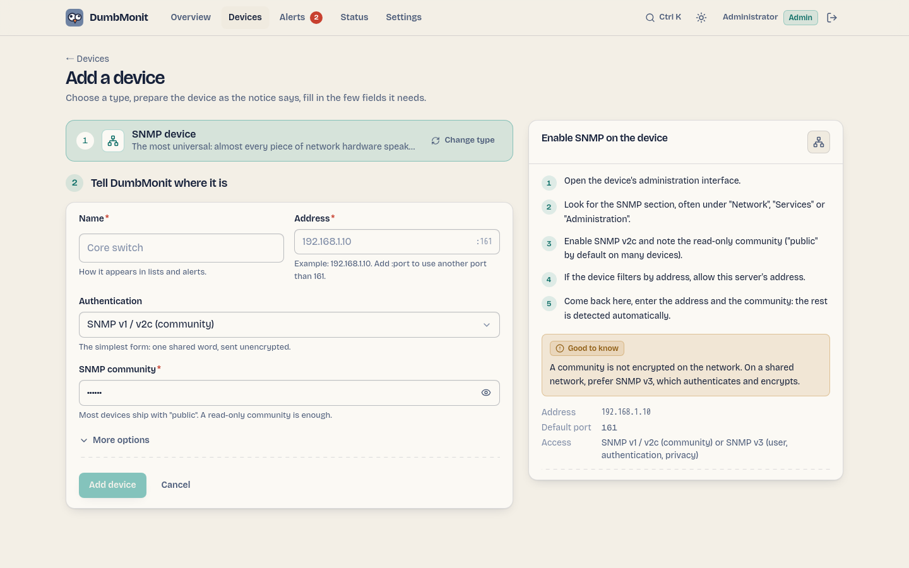

# Add your first device

Adding anything always works the same way: pick a type from the list, a notice
on the right explains what to prepare on the device, and the form only shows the
fields that matter for that type.

## The three first steps

On a brand-new instance the overview does not show an empty bulletin: it shows a
short guide — **add your first device**, **connect a way to be told**, **check a
message arrives**. Each step is one click, and each turns green on its own. The
third one only counts a message that really left a channel, so creating a
channel and never testing it does not tick it.

The guide is kept on the instance, not in the browser: skipping a step, or the
whole guide, skips it in every browser and for every user. It disappears for
good once the three steps are settled, and it never appears on an instance that
already had devices and a channel — upgrading does not hand an established
homelab a tutorial.

## Add an SNMP device

SNMP is the most universal type: almost every piece of network hardware speaks
it. Switches, routers, NAS, UPS and printers are the usual suspects.

1. On the device, enable SNMP v2c and note the read-only community (`public` by
   default on many devices). If the device filters by address, allow the
   DumbMonit server's address.
2. In DumbMonit, open **Devices** and click **Add a device** (or press
   ++ctrl+k++ and type "add").
3. Pick **SNMP device**. The picker folds into one row and the form shows the
   fields for SNMP.
4. Enter a **name**, the **address** (IP or host name) and the **community**.
   For SNMP v3, switch the credential to *SNMP v3* and fill in the user name and
   the authentication and privacy passphrases.
5. Click **Add device**.

{ loading=lazy }

The collection profile is detected automatically from the device's
`sysObjectID`, in the background, so the form never waits for an unreachable
device. Interfaces, and on servers and NAS the CPU, memory and storage, appear
within a minute.

!!! warning "Communities travel in clear text"
    An SNMP v1/v2c community is not encrypted on the network. On a shared
    network, prefer SNMP v3, which authenticates and encrypts.

## Scan a network

Rather than typing devices one by one, scan a range:

1. On **Add a device**, open the **Scan my network** panel.
2. Enter a network in CIDR notation, for example `192.168.1.0/24` (up to 4096
   addresses per scan), and the community to try on every address (`public` by
   default).
3. Every address that answers is listed with its `sysName`, description and the
   profile that would be applied. Devices already in DumbMonit are marked
   *Already added*, and everything new is ticked for you.
4. Untick what you do not want, then click **Add *n* devices**. They are created
   one by one, each row showing its own outcome, so one failure never stops the
   rest.

## Add a Proxmox VE server

The same flow, with a credential in two fields rather than one:

1. In Proxmox, create a user reserved for monitoring, a read-only role and an
   API token — the four `pveum` commands are in the notice next to the form,
   with a copy button each, and on the [Proxmox VE page](../devices/proxmox.md).
   Never reuse the account you log in with.
2. In DumbMonit, **Add a device** → **Proxmox VE**.
3. Enter a **name** and the **address** of any node (port 8006 by default).
4. Copy the token's **full-tokenid** (`dumbmonit@pve!monitor`) into **Token
   ID** and its **value** (the UUID) into **Secret**. Pasted the whole
   `user@pve!name=secret` string into Token ID by mistake? The form splits it
   and says so.
5. Proxmox ships with a self-signed certificate: tick **Accept an unverifiable
   certificate** under *More options* if the first probe complains about it.
6. Click **Add device**.

[Proxmox Backup Server](../devices/pbs.md) works the same way with
`proxmox-backup-manager`; a [Synology NAS](../devices/synology.md) takes a
dedicated DSM account (user name and password); a
[server with the agent](../devices/agent.md) needs no credential at all, only
the enrollment token shown once the device is saved.

## The setup notice

Every type carries its own notice, written by the server and shown next to the
form: numbered steps to do on the device (create a read-only user, create an
API token, allow the address…), with the exact menu path in the product and a
copy button on every command or value, then a common pitfall and a link to the
vendor's documentation when there is one. The per-kind pages in this
documentation carry the same steps word for word — a test in the server keeps
them identical: [SNMP](../devices/snmp.md), [Proxmox VE](../devices/proxmox.md),
[Proxmox Backup Server](../devices/pbs.md), [Synology DSM](../devices/synology.md),
[agent](../devices/agent.md), [services](../devices/services.md).

The principle behind every notice: a dedicated read-only account, never the
one you log in with. A leaked monitoring secret must not be able to change
anything.

## Common fields

Whatever the type, the form has:

| Field | Meaning |
|---|---|
| Name | How the device appears in lists and alerts. |
| Address | IP, host name, `host:port` or URL depending on the type; the placeholder shows the expected shape. |
| Credential | The families the type accepts, each with its own fields: community, SNMP v3 user and passphrases, Proxmox token (Token ID + Secret), user name and password. Secrets have a show/hide eye and pasted values are cleaned of stray spaces, quotes and line breaks. Stored encrypted, never returned by the API: on edit, blank fields keep what is saved. |
| Check interval | How often DumbMonit reads the device. Default 60 s, minimum 10 s. |
| Parent device | If the parent goes down, alerts from this device are suppressed instead of sent. See [dependency suppression](../alerting/index.md#dependency-suppression). |
| Enabled | A paused device is not checked and raises no alerts. |
| Tags | Free key/value labels, copied on every series as `tag_<key>`. Type-specific options live here too, under **More options**. |

## What happens next

- The device shows up on the **Devices** page as a rack faceplate: status LED,
  name, kind, address, last seen, and a sparkline.
- Measurements are written to VictoriaMetrics every 5 seconds
  (`DUMBMONIT_FLUSH_INTERVAL_SECS`), so the first graph appears after the first
  probe plus a few seconds. **Probe now** on the device page forces a probe and
  reports how many samples and series it produced: it is the main diagnostic tool.
- The [built-in alert rules](../alerting/rules.md) apply immediately: device
  unreachable, CPU saturated, disk almost full, and so on. Nothing to configure.
- To be notified, add a [notification channel](../notifications.md) in
  **Alerts → Notifications**. Built-in rules notify every enabled channel.

!!! tip "No data after a minute?"
    Open the device page: a configuration error (wrong community, refused
    certificate, missing capability) is shown in red under the address, with the
    reason. See the [FAQ](../faq.md#no-data-after-adding-a-device).
