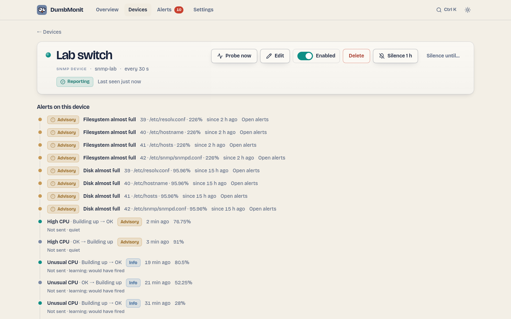

# The devices page

{ loading=lazy }

## The rack

Every device is a 1U rack faceplate: a status LED, the name, the kind stamp,
the address, when it was last seen, and a sparkline of a representative metric.
Children stack under their parent and dim when the parent is unreachable.

| State | Meaning |
|---|---|
| Reporting | The last probe succeeded, within three periods. |
| Unreachable | The last probe failed, or no probe for more than three periods (at least 90 s). |
| Waiting | Added, not probed yet. |
| Disabled | Paused: not checked, raises no alert. |

Filters: a search box, a state segment (All, Needs attention, Reporting,
Disabled) and a kind filter. **Add a device** is the primary action.

## A device

{ loading=lazy }

The device page shows its state plate, address, kind, detected profile, tags,
last probe, and for services the certificate status. Actions:

| Action | Effect |
|---|---|
| Probe now | Runs one probe immediately and reports how many samples and series it produced. The first thing to try when a device shows no data. |
| Edit | Opens the same form as when adding, prefilled. Leaving the credential empty keeps the stored one. |
| Silence 1 h / Silence until… | A one-off maintenance window on this device. |
| Delete | Asks "Delete for good?" inline for five seconds, then deletes the device. Its series stay in VictoriaMetrics until retention expires. |

Below: **Alerts on this device**, then **Metrics** over a time range (1 h,
6 h, 24 h, 7 days), one chart per metric name with one line per series.

Services (HTTP, TCP, DNS, ping, TLS) get instruments instead: **Availability**
over the last 24 hours or 7 days, **Response time**, the number of **Checks**,
and a **History** bar of slots (oldest on the left) showing when the service
was down.

## Adding and editing

See [Add your first device](../install/first-device.md) for the form and the
[device types](../devices/index.md) for what each type needs. When editing, the
form opens **More options** by itself if the device already uses one.

## Deleting

Deleting a device removes it from the configuration. Its time series are not
deleted: they age out with the 12-month retention.
