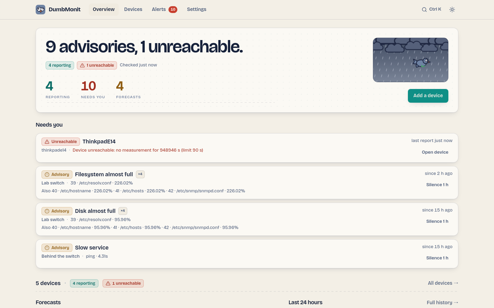
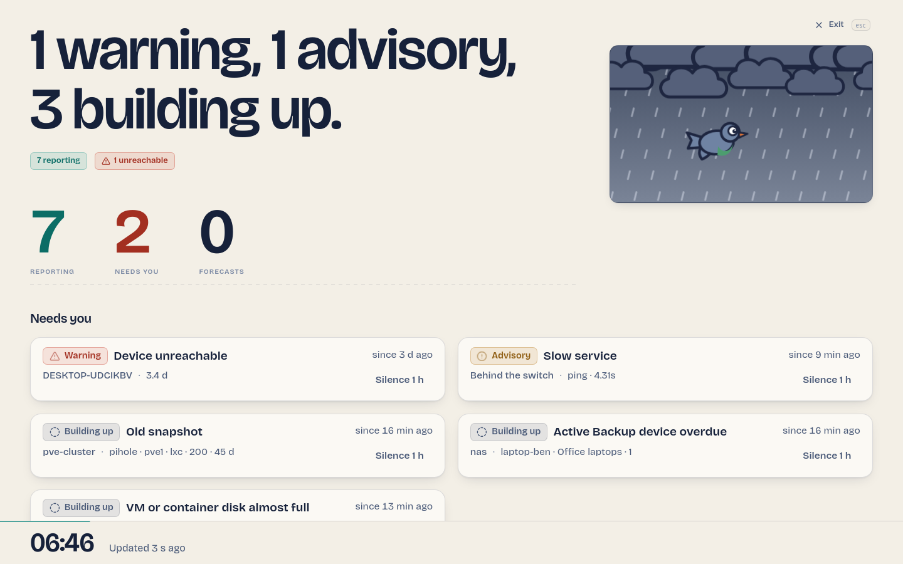

# The overview page

The home page answers "is everything fine?" in about one second, then lets you
drill down on demand.

{ loading=lazy }

## The bulletin

The band at the top is a weather bulletin for your network. One sentence states
the sky: "Clear skies." when nothing needs you, otherwise a count of what does
("9 advisories, 1 unreachable."). Under it, plates count devices reporting and
unreachable, with the time of the last check, and three readouts: **Reporting**,
**Needs you**, **Forecasts**.

The weather window on the right follows the network: clear, cloudy, overcast or
storm, depending on how many alerts are firing and how severe they are, with the
pigeon flying across. Under `prefers-reduced-motion`, everything is still.

The single primary action of the page is **Add a device**.

## Needs you

The list of what needs you now, most severe first: unreachable devices, then
firing alerts by severity. Each row names the rule, the device, the current
value, how long it has been going on, and whether it groups several series
("×4" for four filesystems on the same device). Two actions: **Open device**
and **Silence 1 h**, a one-hour maintenance window on that device.

Alerts suppressed by a parent or still building up are not in this list.

## Devices summary

One line: how many devices, how many reporting, how many unreachable, and a
link to the full Devices page. The overview never lists devices: the rack lives
on [Devices](devices.md).

## Forecasts and last 24 hours

**Forecasts** shows what is predicted rather than observed: the seasonal
baseline anomaly, the "full within four days" extrapolations, the PBS
fill-up estimate, and rules whose name announces a prediction. While a baseline
is learning, its entries say so.

**Last 24 hours** lists the firing transitions of the day, with a link to the
full history on the Alerts page.

## Wall mode

`/wall` shows the bulletin alone, full screen, for a room monitor: the
sentence, the counts and the *Needs you* list, refreshed every 20 seconds, with
the screen kept awake. ++esc++ or **Exit** returns to the overview. Open it from
the command palette ("Wall mode") or by typing the URL.

{ loading=lazy }

## Command palette

++cmd+k++ on macOS, ++ctrl+k++ elsewhere, opens the command palette: one
input, results in three groups.

| Group | Entries |
|---|---|
| Pages | Overview, Devices, Alerts, Notifications, Status pages, Settings, Wall mode, Documentation |
| Actions | Add a device, Scan my network, Schedule maintenance, Add notification channel, New status page, Announce an incident, Toggle theme |
| Devices | Every device, with its state LED; ++enter++ opens it |

## Navigation

The top bar has Overview, Devices, Alerts (with the count of what needs you),
Status and Settings, the palette shortcut and the theme toggle. On a phone, it
becomes a bottom tab bar with the same five entries.

- **Overview** — the bulletin: is everything fine, and what needs you.
- **Devices** — the rack; every source you monitor. See [Devices page](devices.md).
- **Alerts** — what is firing, scheduled maintenance, the rules, and the
  notification channels and policy. See [Alerts page](alerts.md).
- **Status** — the public status pages and their announcements. See
  [Status pages](status-pages.md).
- **Settings** — your account, users and single sign-on, agent and assistant
  tokens, appearance, about. See [Settings](settings.md). Nothing on the interface conveys status by colour alone: a
plate or an LED always comes with a word (Reporting, Unreachable, Advisory,
Warning, Suppressed by parent, Building up).
