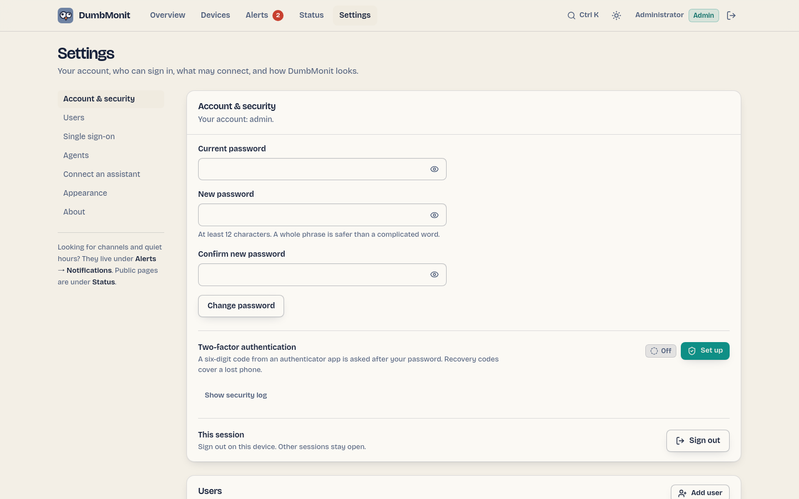

# Settings

{ loading=lazy }

Settings holds what is administrative: your account, who can sign in and
how, the tokens that let agents and assistants in, backing the instance up,
the theme, and the server's health. One page, one section per topic, with a rail of anchors on a
wide screen and a strip of chips on a phone. Each section is linkable
(`/settings#agents`).

Two things used to live here and moved out, because they are not
administration:

| Looking for | Now under | Old link |
|---|---|---|
| Notification channels, quiet hours, notification policy | **Alerts → Notifications** ([Alerts page](alerts.md#notifications)) | `/settings#notifications`, `/settings#notifications-policy` |
| Status pages and announcements | **Status** ([Status pages](status-pages.md)) | `/settings#status` |

The old links still work: they forward to the new place.

## Account & security

This is your own account. The first one is created on first start, and more
can be added below. Here you change your password: current password, new
password (at least 12 characters; a whole phrase is safer than a complicated
word), confirmation. Changing it signs out
every other session. Accounts that sign in through the identity provider have
no password here. **Sign out** ends this session.

Login is rate-limited per client address and per account: after five failed
attempts, each further attempt waits longer (30 s, doubling, up to 5 minutes).
Behind a reverse proxy, set `DUMBMONIT_TRUSTED_PROXIES` so the limiter sees
the real client address rather than the proxy's (see
[Configuration](../reference/configuration.md)). Sessions last 30 days. A
forgotten password is reset with `DUMBMONIT_RESET_PASSWORD=1`: see the
[FAQ](../faq.md#i-lost-the-password).

### Two-factor authentication

Accounts that sign in with a password can add a second factor: a six-digit
time-based code (TOTP) from an authenticator app — Aegis, FreeOTP, Google
Authenticator, 1Password, Bitwarden… **Set up** asks for your password, shows
a QR code to scan (or the key to type), and enables the second factor once you
enter a first code from the app. Eight **recovery codes** are then shown once:
save them, each one signs you in a single time if the phone is lost. The
sign-in screen asks for the code (or a recovery code) after the password;
five wrong codes cancel the attempt and you start over from the password, and
the usual sign-in rate limit keeps counting across attempts. A code is
accepted once: the one you just used (including the one that enabled the
second factor) does not sign you in again — wait for the next one.

**Disable** asks for the password again. Recovery codes cannot be regenerated
on their own: disable and set up again to get a fresh set. An admin can reset
another user's second factor from **Users** (*Reset 2FA*) when both the phone
and the codes are gone — that signs the user out everywhere and leaves the
password alone. The secret is stored encrypted with the instance secret;
codes are hashed. Single sign-on accounts get their second factor from the
identity provider, not here.

Admins also find the **security log** in this section: sign-ins and failures,
password and two-factor changes, token and account changes, with the client
address. It keeps the last 5 000 entries.

## Users

Admins only. The accounts that can sign in, and their role: **admin**
(everything) or **viewer** (read only — every page opens, every control that
would change something is hidden). **Add user** asks for a username, an
optional display name, a role and a password; the button beside the password
field makes up a random one. The password is shown once, to hand over.

Each row carries the role, whether the account signs in with a password or
through the identity provider, whether two-factor is on, and the last sign-in.
**Edit** changes the display name, the role and the password (a reset signs
that user out everywhere and shows the new password once). The **Enabled**
switch suspends an account without deleting it; **Reset 2FA** appears when the
account has a second factor; **Delete** removes it for good. The server keeps
at least one active admin, and the controls reflect that rule rather than
reporting it as an error: the last admin cannot be demoted, disabled or
deleted, and you cannot disable or delete your own account.

## Single sign-on

Admins only. Sign-in through an OpenID Connect provider (Authelia, Authentik,
Keycloak, Pocket ID, Google Workspace…). Fill in the *provider name* (it
labels the "Continue with …" button on the sign-in screen), the *issuer URL*
— discovery is read from `{issuer}/.well-known/openid-configuration` — the
*client id*, the *client secret* (stored encrypted, never shown again) and the
*public URL* browsers reach DumbMonit at. The form builds the redirect URI
from that public URL: copy it and register it with your provider.

**Test discovery** reads the provider's configuration without signing anyone
in, lists the endpoints it found, and warns when the provider signs with
neither RS256 nor ES256 — the only two signatures DumbMonit accepts. Settings
saved here take precedence over the `DUMBMONIT_OIDC_*` environment variables,
which only apply while nothing is saved; **Forget saved settings** clears them
and falls back to the variables when they exist.

**Advanced.** The rest of the form sits under *Advanced*: *Scopes* names what
to ask the provider for, *Groups claim* the token claim that lists the user's
groups, and *Create accounts on first sign-in* decides whether an unknown
person gets an account.

**Roles.** *Admin groups* lists the groups whose members become admins;
everyone else is a viewer. Leave it empty to keep managing roles under
**Users**. Roles are re-evaluated at each sign-in, except that the last active
admin is never demoted.

**Which account a sign-in lands on.** The identity is remembered by its
provider subject after the first sign-in. On a first sign-in:

- An existing account is linked only when the provider asserts
  `email_verified: true` and that email is the account's username. A
  `preferred_username` or an unverified email never links: on most providers
  the user chooses those, so `admin` from the provider must not become *your*
  `admin`.
- A local **admin that has a password is never linked automatically**, even
  on a verified email: the sign-in creates a distinct account instead. Keep
  managing that admin with its password, or create a separate SSO admin
  through the admin groups.
- Otherwise, with *Create accounts on first sign-in* on, a new account is
  created (username from the provider, suffixed `-1`, `-2`… when taken). With
  it off, only the verified-email link above can sign in.

## Agents

Enrollment tokens for the [Linux, macOS, FreeBSD and Windows agent](../devices/agent.md).
Create one with a name ("File server", "Home fleet"): the token is shown once,
with the Linux and Windows install commands ready to copy, and the SHA-256
checksums of the agent binaries this server ships — the installer checks the
download against them by itself, they are there for anyone who wants to
compare by hand. The list shows each token's prefix, creation date, last use
and whether it was revoked. **Revoke** stops every agent using that token at
its next push.

One token can enrol several machines. Revoking it does not delete the devices.
Viewers see the list and the section reads *Viewer — read only*; creating and
revoking are for admins.

## API & assistants

One kind of token for both: MCP clients and the
[REST API](../reference/api.md). Name a token, pick its scope and create it —
it is shown once. A **read** token can only look; a **read and write** token
can also change things — silence a device, run a probe, add or edit devices,
rules and channels — but never accounts, sign-in settings or other tokens.

Under **Connect**, three tabs hold the snippets, filled with the token while
it is still on screen: *Claude* (the `claude mcp add` command and the
`claude_desktop_config.json` block), *ChatGPT* (the MCP server URL and the
authorization header, with a warning when this page is not served over HTTPS —
ChatGPT connects from OpenAI's servers, so the address must be reachable from
the internet) and *Cursor / other*, the same shape for any client that speaks
Streamable HTTP with a bearer header. **API access** shows the same token on
the REST API as a `curl` example, and points at the routes a Prometheus or a
Grafana scrapes with it. See [Connect an assistant](assistant.md) and
[Scraping DumbMonit](../reference/metrics.md#scraping-dumbmonit).

## Backup

Three things, in the order you meet them.

A **warning you cannot miss**: `/data/secret.key` is what decrypts device
credentials, and a copy of the database without it restores an instance that
cannot talk to anything. The wording changes when the secret comes from
`DUMBMONIT_SECRET` instead — there is then no file to copy, and it is your
password manager that has to hold it.

**Export the configuration** lists what the bundle would contain, with a count
per section, then asks for a passphrase twice. The file that comes down holds
every credential of this instance, encrypted with that passphrase alone: keep
it where you keep passwords. Account passwords and 2FA secrets are left out
unless you turn the switch on.

**Restore a bundle** takes the file and its passphrase and shows a **dry run**
first: a table of what would be created, updated and left alone, section by
section, with a note for anything it cannot place. Nothing is written until you
press *Restore for real*.

**Scheduled local backups** shows whether they are on, where they go, the last
run and whether it succeeded, and the files kept with their size. **Back up
now** writes one immediately — the thing to do before an upgrade.

Everything here is admin-only. See [Backup and restore](../install/backup.md).

## Appearance

Three tiles, each previewing its own theme: **System** (follows your device and
switches with it), **Day** (the "chart paper" theme) and **Night** (the
"radar" theme). The choice is stored in the browser. The header's toggle and
the command palette's *Toggle theme* switch between day and night.

**Open wall mode** sits at the bottom of the section: the bulletin alone, full
screen, for a monitor in the room. ++esc++ leaves it, and the command palette
opens it from anywhere — see [Wall mode](overview.md#wall-mode).

## About

Version of the server and the health of its two stores, the database (device
setup and alert history) and VictoriaMetrics (every measurement in the
charts), as reported by `GET /api/health` and refreshed every 15 seconds. A
store that stops answering shows a warning with the error and what to check.
The section also links to this documentation and names the licence, Apache
2.0.
