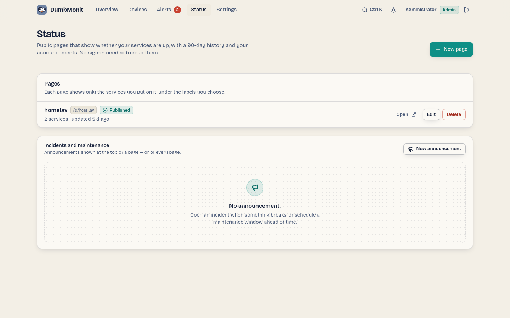

# Status pages

{ loading=lazy }

A status page is the public face of your monitoring: a page anyone can open —
no sign-in, no cookie — that says whether your services are up, shows their
uptime over the last 90 days, and carries your incident and maintenance
announcements. Think of it as a small Uptime Kuma or Kener page, built into
DumbMonit.

It only shows what you put on it: the label you give each service, its state
and its uptime. Device addresses, types and identifiers never leave the
server.

## 1. Create a page

**Status** in the top bar → **New page**. That page lists your status pages
(open, edit, delete) with the announcements under them; the editor opens on
its own route (`/status/new`, `/status/<id>`). The public rendering is at
`/s/<address>`.

| Field | What it does |
| --- | --- |
| **Title** | The heading of the page ("Home lab"). |
| **Address** | The last part of the URL, `/s/<address>`. Suggested from the title; lowercase letters, digits and hyphens, 2 to 40 characters. |
| **Description** | One sentence under the title. Optional. |
| **Theme** | Day, night, or follow the visitor's system. |
| **History** | How many days the uptime bar covers (30, 60 or 90). |
| **Published** | Off = draft: the page answers "not found" to visitors until you switch it on. |

Then tick the devices to show. For each one, set the **label** visitors will
read (it defaults to the device name — you may prefer "Website" to
"nginx-front-01") and, optionally, a **group** ("Network", "Storage"). Groups
become blocks on the page, in the order you arrange the services.

Save, and the link is ready to copy. The page refreshes itself every minute.

## 2. What visitors see

- A banner with the one-second answer, read from the services: **All systems
  operational**, **Partial outage** (some down or degraded), **Major outage**
  (all down) or **Scheduled maintenance**. An open incident while every
  service still answers reads **Incident in progress**, toned by its impact.
- The open announcements, newest update first, with the timeline of updates
  under a fold.
- Each service with its state plate (Operational, Degraded, Down, Maintenance,
  No data), one thin bar per day toned by that day's uptime (hover or focus a
  bar for the date, the percentage and the incidents that touched it), uptime
  over 24 h, 7 d and the whole history, and the response time for uptime
  probes.
- **Past incidents**, by day, for the last 30 days.

How the state is decided:

| State | Meaning |
| --- | --- |
| Operational | The last probe succeeded (uptime probes), or the device reported within three polling periods. |
| Degraded | Up now, but at least one probe failed within the last hour. |
| Down | The last probe failed, the device stopped reporting, or its configuration is in error. |
| Maintenance | A maintenance window is in progress and the service is down: expected, not an outage. Either an announcement on this page, or an alerting [maintenance window](../alerting/maintenance.md) covering that device. |
| No data | Never probed yet, or disabled. |

Uptime for probes (`http`, `tcp`, `dns`, `ping`, `tls`) is the share of
successful checks. For other devices (SNMP, agent, Proxmox…) it is the share of
five-minute slots in which the device reported at least once, counted from the
first measurement — a device added yesterday is not "down" for the 89 days
before that.

## 3. Announce incidents and maintenance

On the **Status** page, under the list of pages, **Incidents and maintenance**
→ **New announcement** (also ++ctrl+k++ → *Announce an incident*).

- An **incident** has a title, an impact (**minor** shows the page as
  degraded, **major** as an outage) and moves through *Investigating →
  Identified → Monitoring → Resolved*. Post updates as you go: each one carries
  a status and a message, and becomes the latest line visitors read.
  **Resolve** closes it with a final message; it then moves to "Past
  incidents" for 30 days.
- A **maintenance** window has a start and an end and moves through *Scheduled
  → In progress → Completed*. While it is in progress the banner says
  "Scheduled maintenance" and services that are down show as *Maintenance*.

A [maintenance window scheduled in Alerts](../alerting/maintenance.md) does the
same thing for the one device it covers, without an announcement: that service
reads *Maintenance* instead of red while the window is open, and the page's
overall state says *Maintenance* when nothing else is down or degraded. Only
windows that name a device surface this way; the window's name and comment stay
private.

An announcement is shown on one page or on **all pages**.

## 4. Share the link

The page lives at `https://your-server/s/<address>`. Everything under `/s/` and
`/api/public/` is served without authentication; the rest of DumbMonit stays
behind sign-in.

### Behind a reverse proxy

If DumbMonit itself is private, you can expose only the status page. With
Caddy, for example:

```caddyfile
status.example.com {
    @public path /s/* /api/public/* /_app/* /favicon.svg
    reverse_proxy @public dumbmonit:8080
    respond 404
}
```

With nginx:

```nginx
location ~ ^/(s/|api/public/|_app/|favicon\.svg) {
    proxy_pass http://dumbmonit:8080;
    proxy_set_header Host $host;
    proxy_set_header X-Forwarded-Proto $scheme;
}
location / { return 404; }
```

`/_app/` carries the interface's scripts and styles: the page needs them to
render. Forward `X-Forwarded-Proto` and `X-Forwarded-Host` so that the RSS
feed links to the right address.

### Badge and feed

Each published page also serves:

- `GET /api/public/status/<address>/badge.svg` — a shields-style badge
  ("status: operational") you can drop into a README:

  ```markdown
  
  ```

- `GET /api/public/status/<address>/rss` — an RSS feed of incidents and
  maintenance windows, one item per announcement with its latest update.
- `GET /api/public/status/<address>` — the JSON document the page is built
  from, if you want to build your own.

All three are cached for 30 seconds on the server, so a popular page costs the
time-series database nothing.
